# Báo cáo thí nghiệm GR00T N1.7 — LIBERO Object: CKA pruning và matched Action-DiT LoRA recovery

## Tóm tắt điều hành

Thư mục này lưu kết quả đầy đủ của thí nghiệm tối ưu **GR00T N1.7 LIBERO Object** bằng **Centered Kernel Alignment (CKA)**, pruning có cấu trúc và recovery fine-tuning bằng **LoRA trên Action-DiT**. Baseline và mô hình CKA được recovery theo cùng một protocol để phép so sánh công bằng trong giới hạn GPU Tesla T4 của Kaggle.

Kết quả chính:

- Pipeline đã hoàn tất từ đầu đến cuối: capture hidden states/activations, tính CKA, sinh pruning manifest, prune layer, matched LoRA recovery 3.000 bước, benchmark offline, heatmap sau recovery, rollout đủ LIBERO Object và lưu video.
- CKA loại **4/16 language layers** và **8/32 Action-DiT blocks**, giữ nguyên 4 VL self-attention layers.
- Số tham số giảm từ **3,144B xuống 2,675B (−14,91%)**; mean latency giảm **15,76%**, P95 giảm **17,28%**, peak allocated VRAM giảm **14,89%**; inference speedup đạt **1,187×** trên Tesla T4.
- Offline pointwise error xấu đi: MSE tăng từ **0,000336 lên 0,001262 (+276,00%)**, MAE tăng từ **0,007415 lên 0,013641 (+83,98%)**.
- Closed-loop LIBERO Object vẫn được giữ: baseline đạt **198/200 = 99,0%**, CKA đạt **199/200 = 99,5%**. Chênh lệch một episode không đủ để kết luận CKA chính xác hơn baseline, nhưng cho thấy mô hình sau pruning vẫn giữ được functional parity trong thử nghiệm này.
- Model-only P95 của cả hai model nằm trong action-chunk budget giả định 400 ms; nhưng policy RPC closed-loop vẫn vượt budget, nên chưa đạt strict real-time theo giả định 20 Hz và action chunk 8 bước.

> Quy ước trong báo cáo: **baseline** là checkpoint `nvidia/GR00T-N1.7-LIBERO/libero_object` sau matched LoRA recovery 3.000 bước; **CKA** là cùng checkpoint sau structural pruning theo manifest rồi recovery với cùng cấu hình. Đây là thí nghiệm post-pruning recovery, không phải tái huấn luyện GR00T N1.7 từ checkpoint 3B gốc.

---

## 1. Mục tiêu, phạm vi và luồng thí nghiệm

Mục tiêu là kiểm tra liệu các layer có representation dư thừa theo CKA có thể bị loại để giảm tài nguyên inference mà vẫn giữ khả năng hoàn thành task robot trong simulator hay không.

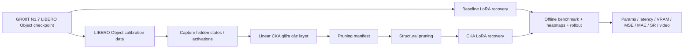

Pipeline dùng CKA như một tiêu chí chọn layer, không coi CKA cao là bằng chứng trực tiếp rằng layer không quan trọng. Quyết định cuối vẫn phải được kiểm chứng bằng offline error và đặc biệt là closed-loop success rate.

---

## 2. Thành phần và cấu hình thí nghiệm

### 2.1. Model, dataset và phần cứng

| Hạng mục | Giá trị thực thi |
|---|---|
| Model nguồn | `nvidia/GR00T-N1.7-LIBERO/libero_object` |
| Embodiment | `LIBERO_PANDA` |
| Simulator suite | `libero_object`, gồm 10 task pick-and-place |
| Dataset | `IPEC-COMMUNITY/libero_object_no_noops_1.0.0_lerobot` |
| Định dạng | LeRobot; RGB, proprioception, language instruction và Panda actions |
| GPU capture/benchmark | Tesla T4, `cuda:0` |
| PyTorch | `2.9.0+cu128` |
| Seed | 42 |

Dataset dùng trong thí nghiệm là LIBERO Object trên Hugging Face, không phải `demo_data` nhỏ trong repo. Nguồn cấu hình capture được ghi trong [`source_calibration/metadata.json`](source_calibration/metadata.json).

### 2.2. Tách calibration và offline validation

| Tập sử dụng | Trajectory IDs | Lấy mẫu | Tổng mẫu |
|---|---|---:|---:|
| CKA calibration | 0, 1, 3, 4, 6, 7, 9, 12, 14, 16 | 8 mẫu/trajectory, stride 8 | 80 |
| Offline validation | 22, 2, 49, 5, 11, 10, 15, 20, 23, 19 | 8 mẫu/trajectory, stride 8 | 80 |

Hai danh sách trajectory không trùng nhau và được chọn theo task để bao phủ đủ 10 object tasks. Cả capture và benchmark đều dùng 4 denoising steps; benchmark có 2 warmup steps.

### 2.3. Cấu hình CKA

| Module | Prune ratio yêu cầu | Độ sâu gốc | Giữ | Loại | Tỷ lệ thực tế |
|---|---:|---:|---:|---:|---:|
| Backbone language | 25% | 16 | 12 | 4 | 25% |
| Action-DiT | 25% | 32 | 24 | 8 | 25% |
| VL self-attention | 0% | 4 | 4 | 0 | 0% |

Phương pháp trong artifact là `adjacent_linear_cka_topk`: biểu diễn của các layer được so sánh bằng linear CKA, sau đó các vùng có representation gần nhau được dùng để chọn cấu hình giữ layer. Manifest chính xác nằm tại [`source_cka_analysis/pruning_manifest.json`](source_cka_analysis/pruning_manifest.json).

| Module | Layer giữ lại | Layer bị prune |
|---|---|---|
| Backbone language | 0, 1, 2, 3, 7, 8, 9, 10, 11, 12, 13, 15 | **4, 5, 6, 14** |
| Action-DiT | 0, 1, 2, 3, 4, 5, 6, 8, 10, 14, 18–31 | **7, 9, 11, 12, 13, 15, 16, 17** |
| VL self-attention | 0, 1, 2, 3 | — |

### 2.4. Matched Action-DiT LoRA recovery

Nguồn chuẩn là [`recovery_contract.json`](recovery_contract.json).

| Hạng mục | Baseline và CKA |
|---|---|
| Protocol | `matched_action_dit_lora_recovery_v1` |
| Recovery steps | 3.000 |
| Batch / gradient accumulation | 1 / 8, effective batch 8 |
| Learning rate | `1e-4` |
| State dropout | 0,2 |
| LoRA | rank 16, alpha 32, dropout 0,05 |
| LoRA target | Mọi `Linear` module trong mỗi Action-DiT block còn tồn tại |
| Fully trainable small modules | LoRA A/B, `timestep_encoder`, `proj_out_1`, `proj_out_2` |
| Frozen | Qwen3-VL language, vision tower, VLLN, base Action-DiT weights, state/action encoder-decoder, position embedding |
| Activation checkpointing | Bật |
| Checkpoint format | Adapter-only resumable; LoRA được merge khi final export |

Log final export cho biết:

| Model | Retained DiT blocks | Linear modules gắn LoRA | LoRA params | Tổng params trainable trong recovery |
|---|---:|---:|---:|---:|
| Baseline | 32 | 224 | 16.777.216 | 25.828.352 |
| CKA | 24 | 168 | 12.615.680 | 21.666.816 |

Các số này được lấy từ [`logs/LoRA_recovery_baseline_to_step_3000.log`](logs/LoRA_recovery_baseline_to_step_3000.log) và [`logs/LoRA_recovery_cka_to_step_3000.log`](logs/LoRA_recovery_cka_to_step_3000.log). Đây mới là adapter recovery budget; trường `trainable_parameter_count` trong summary benchmark phản ánh trạng thái model đã merge/load và không nên dùng thay cho số tham số LoRA thực sự được tối ưu.

Recovery được chia thành nhiều stage có resume để chịu được giới hạn phiên Kaggle. Tổng wall-clock của các stage hoàn thành là **13.159,51 s (3,66 giờ)** cho baseline và **11.586,78 s (3,22 giờ)** cho CKA, giảm **11,95%**. Thời gian này gồm model loading và checkpoint export lặp lại giữa các session, không phải pure optimizer time. Lịch sử đầy đủ nằm trong [`recovery_stage_history.json`](recovery_stage_history.json).

---

## 3. Đối chiếu với protocol LIBERO chính thức trong repo

Repo tham chiếu công bố LIBERO Object **197/200**, huấn luyện 20K steps, global batch 640, 8 GPU và bắt đầu từ checkpoint N1.7-3B. Xem [`examples/LIBERO/README.md`](../examples/LIBERO/README.md) và [`examples/finetune.sh`](../examples/finetune.sh).

| Tiêu chí | Protocol repo | Thí nghiệm này | Đánh giá |
|---|---|---|---|
| Dataset / embodiment | LIBERO Object no-noops, `LIBERO_PANDA` | Đúng dataset và embodiment | Đạt |
| Model xuất phát để reproduce benchmark | `nvidia/GR00T-N1.7-3B` | Checkpoint LIBERO Object đã fine-tuned | Khác mục tiêu: post-pruning recovery |
| GPU | 8 GPU | 1 Tesla T4 cho từng process | Không đạt do tài nguyên Kaggle |
| Max steps | 20.000 | 3.000 | 15% số optimizer step chính thức |
| Global batch | 640 | Effective batch 8 | Nhỏ hơn 80 lần |
| State dropout | 0,2 | 0,2 | Đạt |
| Fine-tuning | Full recipe | Parameter-efficient LoRA trên Action-DiT | Không phải full fine-tune |
| Structural CKA pruning | Không phải protocol NVIDIA mặc định | 25% language + 25% Action-DiT | Thử nghiệm tối ưu bổ sung |
| Closed-loop evaluation | 200 episode/suite | 10 task × 20 episode/model | Đạt đúng episode count |
| Seed / độ bất định | Bảng repo không cung cấp CI | Một seed 42, không CI | Chưa đủ kết luận thống kê |

Do đó, báo cáo này là một **thí nghiệm tối ưu có đánh giá closed-loop đầy đủ**, không phải reproduction 1:1 của quá trình training chính thức.

---

## 4. Kết quả benchmark offline

Nguồn chuẩn:

- [`final_comparison/comparison.json`](final_comparison/comparison.json)
- [`eval_baseline/summary.json`](eval_baseline/summary.json)
- [`eval_cka/summary.json`](eval_cka/summary.json)

| Metric | Baseline | CKA | Thay đổi CKA | Nhận xét |
|---|---:|---:|---:|---|
| Parameter count | 3.144.016.000 | 2.675.149.952 | **−14,91%** | Structural pruning có hiệu lực thật |
| Model load time | 57,49 s | 51,18 s | **−10,97%** | Khởi tạo nhanh hơn |
| Cumulative recovery wall-clock | 13.159,51 s | 11.586,78 s | **−11,95%** | CKA train/recovery nhẹ hơn |
| Mean latency | 200,99 ms | 169,31 ms | **−15,76%** | Speedup inference rõ ràng |
| Median latency | 200,07 ms | 168,35 ms | **−15,86%** | Gain không chỉ đến từ outlier |
| P95 latency | 210,70 ms | 174,28 ms | **−17,28%** | Tail latency tốt hơn |
| Peak allocated VRAM | 5,949 GiB | 5,063 GiB | **−14,89%** | Tiết kiệm khoảng 0,886 GiB |
| Peak reserved VRAM | 6,039 GiB | 5,178 GiB | **−14,26%** | Giảm memory reserve |
| Offline MSE | 0,000336 | 0,001262 | **+276,00%** | Xấu hơn 3,76× theo tỷ lệ |
| Offline MAE | 0,007415 | 0,013641 | **+83,98%** | Xấu hơn 1,84× theo tỷ lệ |

Inference speedup tổng hợp là **1,187×**. Prediction drift giữa CKA và baseline là MSE **0,001167**, MAE **0,011557**, xác nhận rằng pruning + recovery đã làm policy sinh action khác baseline.

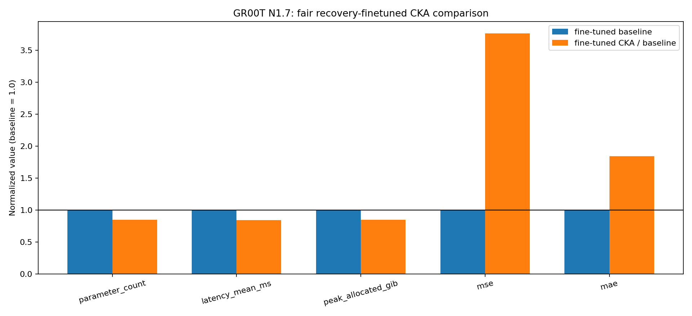

Biểu đồ cho thấy trade-off rất rõ: parameter, latency và VRAM đều giảm xuống dưới mốc baseline 1,0; MSE/MAE tăng mạnh. Vì giá trị MSE/MAE gốc vốn nhỏ, phần trăm tăng nhìn rất lớn; tuy nhiên degradation là có thật và không được bỏ qua.

### Prediction so với ground truth

| Baseline recovery 3K | CKA recovery 3K |
|---|---|
| 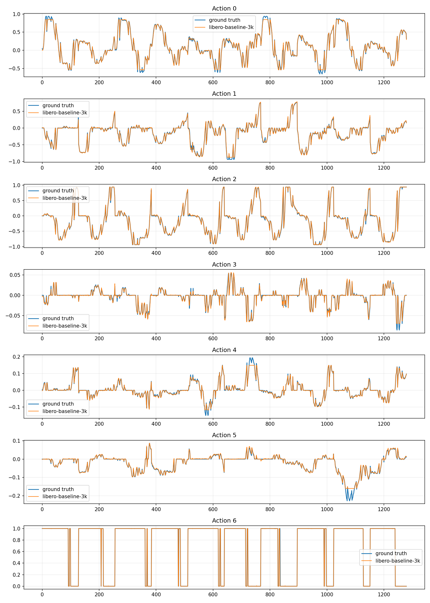 | 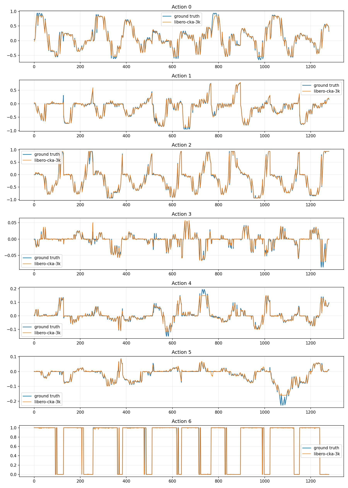 |

Ở cả hai plot, prediction vẫn bám được hình dạng và các pha chuyển trạng thái của ground truth trên bảy action dimensions. CKA có sai lệch lớn hơn ở các transition nhanh và biên độ nhỏ, phù hợp với MSE/MAE cao hơn. Đây là diagnostic pointwise trên 80 mẫu, không thay thế kết quả rollout closed-loop.

---

## 5. Phân tích CKA và representation

### 5.1. Source CKA trước pruning

| Backbone language | Action-DiT | VL self-attention |
|---|---|---|
| 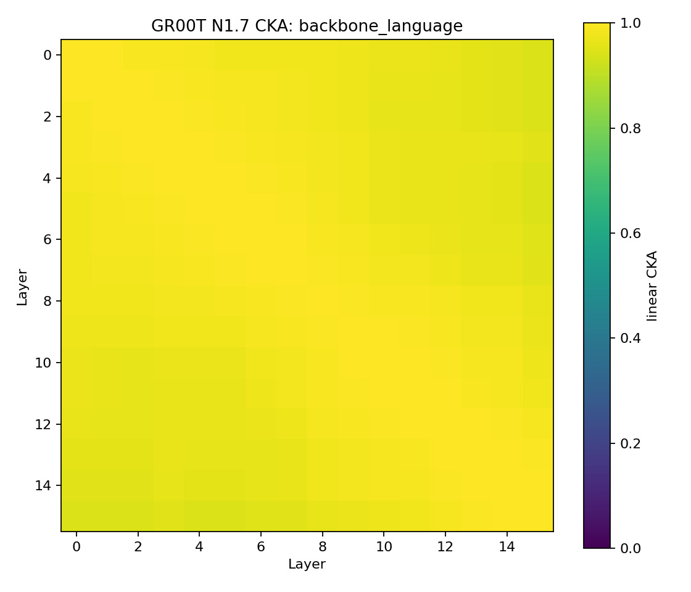 | 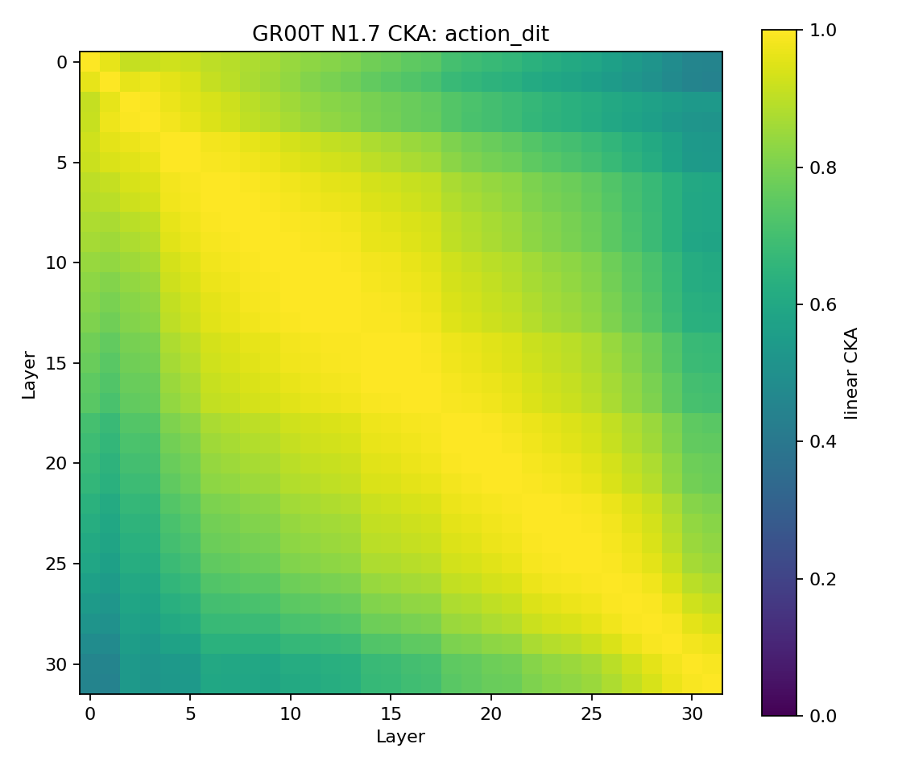 |  |

Backbone language có CKA rất cao giữa nhiều layer nên heatmap gốc gần như một màu vàng. Đây không phải lỗi tính toán: adjacent CKA nằm khoảng 0,995–0,999. Các bản contrast/distance giúp quan sát chênh lệch nhỏ:

- [`source_cka_analysis/backbone_language_cka_distance.png`](source_cka_analysis/backbone_language_cka_distance.png)
- [`source_cka_analysis/action_dit_cka_distance.png`](source_cka_analysis/action_dit_cka_distance.png)
- [`source_cka_analysis/vl_self_attention_cka_distance.png`](source_cka_analysis/vl_self_attention_cka_distance.png)
- [`source_cka_analysis/backbone_language_cka_zoom.png`](source_cka_analysis/backbone_language_cka_zoom.png)
- [`source_cka_analysis/action_dit_cka_zoom.png`](source_cka_analysis/action_dit_cka_zoom.png)
- [`source_cka_analysis/vl_self_attention_cka_zoom.png`](source_cka_analysis/vl_self_attention_cka_zoom.png)

Action-DiT cho thấy cấu trúc dải chéo: layer gần nhau tương đồng cao, còn layer đầu và cuối khác nhau rõ hơn. Điều này hỗ trợ pruning theo vùng dư thừa cục bộ thay vì loại layer tùy ý.

### 5.2. Heatmap sau pruning + recovery

| Module | Baseline off-diagonal mean | CKA off-diagonal mean | Adjacent mean: baseline retained → CKA | Mean absolute delta |
|---|---:|---:|---:|---:|
| Backbone language | 0,97791 | 0,98569 | 0,99553 → 0,99692 | **0,00728** |
| Action-DiT | 0,79694 | 0,77724 | 0,98736 → 0,99013 | **0,03407** |
| VL self-attention | 0,82895 | 0,87310 | 0,91288 → 0,93837 | **0,03382** |

| Backbone language | Action-DiT | VL self-attention |
|---|---|---|
| 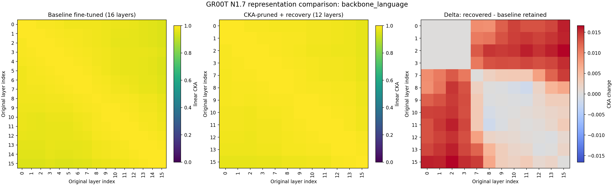 | 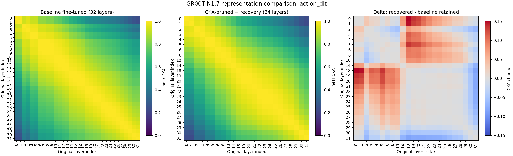 | 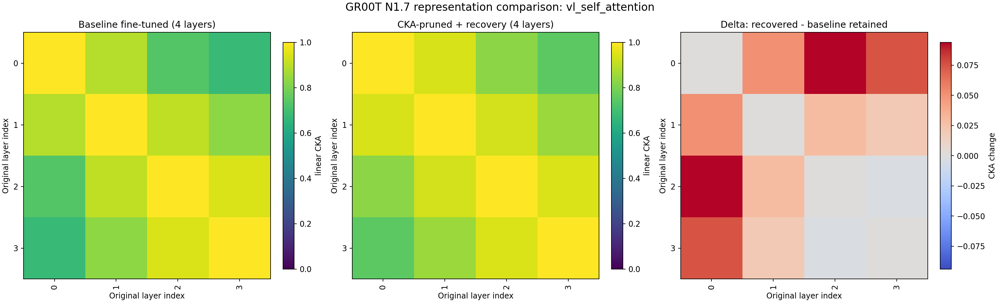 |

Nguồn số: [`heatmap_comparison/cka_before_after_summary.json`](heatmap_comparison/cka_before_after_summary.json).

Language representation sau recovery gần baseline nhất. Action-DiT có delta lớn nhất trong hai module bị prune, nhưng adjacent similarity của các block còn lại vẫn rất cao. VL self-attention không bị prune mà vẫn thay đổi vì input upstream và quá trình recovery đã thay đổi. Heatmap chứng minh representation không sụp đổ, nhưng không tự nó chứng minh task accuracy; kết luận cuối phải dựa vào success rate.

---

## 6. Closed-loop LIBERO Object success rate

Protocol đã được validation là `repo_full`: **10 task × 20 episode × 2 model = 400 scored episodes**. Nguồn chuẩn là [`success_rate/full_sr_validation.json`](success_rate/full_sr_validation.json), [`success_rate/success_rate.csv`](success_rate/success_rate.csv) và [`success_rate/success_rate_summary.json`](success_rate/success_rate_summary.json).

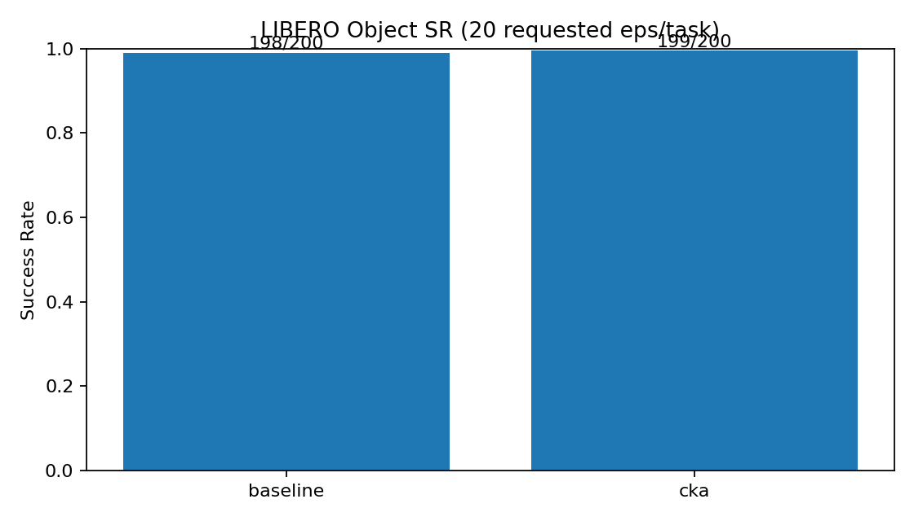

### 6.1. Aggregate

| Model | Successes | Episodes | Success rate |
|---|---:|---:|---:|
| Baseline recovery 3K | 198 | 200 | **99,0%** |
| CKA + LoRA recovery 3K | 199 | 200 | **99,5%** |

CKA cao hơn baseline đúng một success, tương đương +0,5 điểm phần trăm. Với một seed và chỉ một episode chênh lệch, không thể kết luận CKA tốt hơn về chất lượng. Kết luận phù hợp là **CKA giữ parity closed-loop trong lần chạy này trong khi giảm khoảng 15% tài nguyên model**.

### 6.2. Kết quả theo task

| Task | Baseline | CKA | Chênh lệch |
|---|---:|---:|---:|
| Alphabet soup | 20/20 | 20/20 | 0 |
| Cream cheese | 20/20 | 20/20 | 0 |
| Salad dressing | 20/20 | 20/20 | 0 |
| BBQ sauce | 20/20 | 20/20 | 0 |
| Ketchup | 20/20 | 20/20 | 0 |
| Tomato sauce | 20/20 | 20/20 | 0 |
| Butter | 19/20 | 19/20 | 0 |
| Milk | 20/20 | 20/20 | 0 |
| Chocolate pudding | 19/20 | 20/20 | **CKA +1** |
| Orange juice | 20/20 | 20/20 | 0 |

Hai model cùng fail một episode ở task butter; baseline có thêm một fail ở chocolate pudding. Không có task nào giảm success rate sau CKA trong lần rollout này.

### 6.3. Video rollout

Thư mục [`selected_videos/`](selected_videos/) chứa **60 MP4**, tương ứng 3 video/task/model, tổng khoảng 20,19 MiB. Video fail được ưu tiên và gắn nhãn rõ trong tên:

- [Baseline butter fail](selected_videos/06_pick_up_the_butter_and_place_it_in_the_basket/video_pick_up_the_butter_and_place_it_in_the_basket_baseline_fail_01.mp4)
- [CKA butter fail](selected_videos/06_pick_up_the_butter_and_place_it_in_the_basket/video_pick_up_the_butter_and_place_it_in_the_basket_cka_fail_01.mp4)
- [Baseline chocolate pudding fail](selected_videos/08_pick_up_the_chocolate_pudding_and_place_it_in_the_basket/video_pick_up_the_chocolate_pudding_and_place_it_in_the_basket_baseline_fail_01.mp4)

Ví dụ success để review định tính:

- [Baseline BBQ sauce success](selected_videos/03_pick_up_the_bbq_sauce_and_place_it_in_the_basket/video_pick_up_the_bbq_sauce_and_place_it_in_the_basket_baseline_success_01.mp4)
- [CKA BBQ sauce success](selected_videos/03_pick_up_the_bbq_sauce_and_place_it_in_the_basket/video_pick_up_the_bbq_sauce_and_place_it_in_the_basket_cka_success_01.mp4)

Inventory raw ghi nhận 401 video: baseline 200, CKA 201, gồm 398 video success và 3 video fail. Một video CKA dư là artifact từ video wrapper/vectorized rollout và không được tính vào 400 scored episodes. Xem [`success_rate/all_rollout_videos_summary.json`](success_rate/all_rollout_videos_summary.json) và [`success_rate/all_rollout_videos.csv`](success_rate/all_rollout_videos.csv).

---

## 7. Latency và khả năng đáp ứng control deadline

Giả định phân tích là control frequency **20 Hz**, mỗi control step 50 ms và policy query trả một action chunk gồm 8 bước. Vì policy chỉ được query một lần cho mỗi chunk, deadline được dùng là **8 × 50 = 400 ms**. Đây là giả định phân tích, không phải tần số wall-clock đo trực tiếp từ LIBERO.

### 7.1. Model-only latency

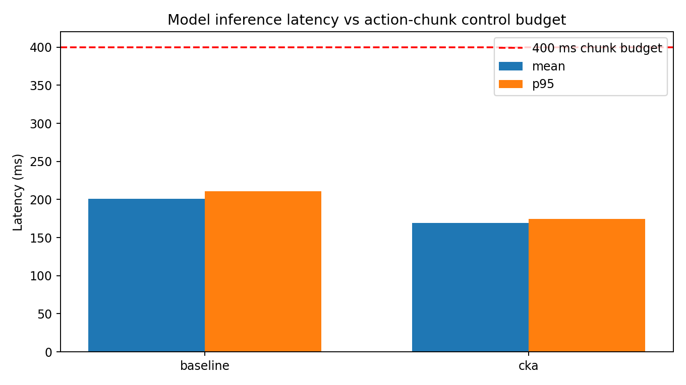

| Model | Mean | P95 | Headroom so với 400 ms | P95 budget utilization | Đánh giá |
|---|---:|---:|---:|---:|---|
| Baseline | 200,99 ms | 210,70 ms | 189,30 ms | 52,67% | Đạt model-only chunk deadline |
| CKA | 169,31 ms | 174,28 ms | 225,72 ms | 43,57% | Đạt, headroom tốt hơn |

Nguồn: [`control_latency/model_latency_control.json`](control_latency/model_latency_control.json).

### 7.2. Closed-loop policy RPC và rollout throughput

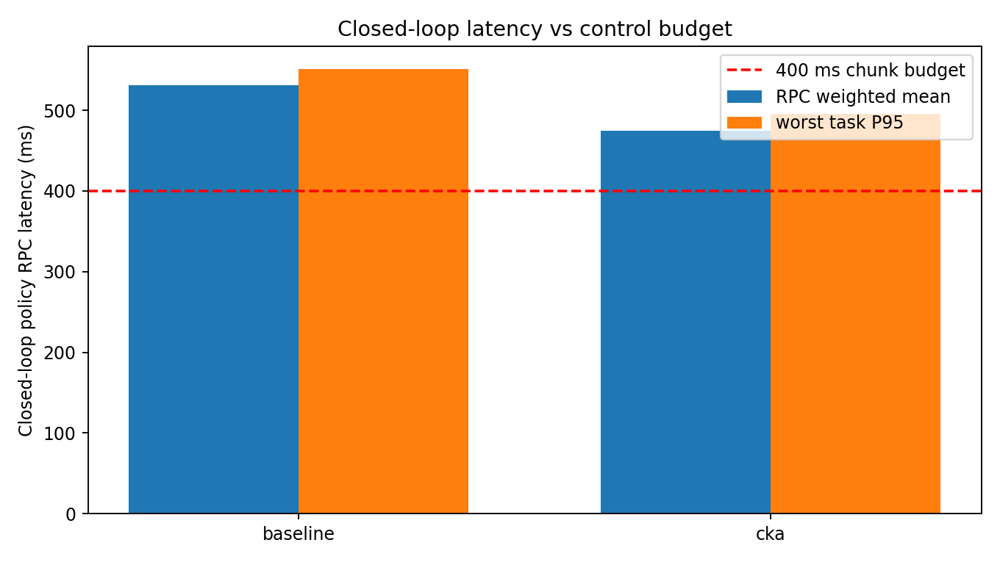

| Metric | Baseline | CKA | Thay đổi |
|---|---:|---:|---:|
| Policy RPC weighted mean | 530,96 ms | 474,57 ms | **−10,62%** |
| Worst-task RPC P95 | 551,25 ms | 495,09 ms | **−10,19%** |
| Worst-task RPC P99 | 582,48 ms | 565,84 ms | −2,86% |
| Deadline miss rate | 100% | 100% | Không đổi |
| End-to-end env steps/s | 6,009 | 6,052 | **+0,72%** |
| Rollout wall-clock / 200 episodes | 4.772,05 s | 4.798,20 s | +0,55% |

Model-only inference nhanh hơn rõ rệt, nhưng RPC thêm preprocessing, serialization, process/network boundary và orchestration nên cả hai model đều vượt budget 400 ms. Việc CKA không làm tổng rollout nhanh hơn tương ứng là hợp lý vì simulator stepping và video encoding chiếm phần lớn end-to-end wall time. Success rate vẫn cao vì rollout synchronous có thể chờ policy; điều này không đồng nghĩa hệ thống đạt strict real-time 20 Hz.

Nguồn: [`success_rate/closed_loop_latency_control.json`](success_rate/closed_loop_latency_control.json).

---

## 8. Kết luận: điều đã chứng minh và giới hạn

### Có thể kết luận

1. CKA pruning đã thay đổi cấu trúc model thật: depth, parameter count, latency và VRAM đều giảm nhất quán.
2. Với mức prune 25% ở language và Action-DiT, model giảm **14,91% tham số**, **15,76% mean latency**, **17,28% P95 latency** và **14,89% peak allocated VRAM**.
3. Matched Action-DiT LoRA recovery 3K giúp mô hình CKA giữ closed-loop performance: **199/200**, gần như ngang baseline **198/200**.
4. Offline pointwise error vẫn xấu hơn đáng kể. Điều này cho thấy MSE/MAE và closed-loop task success đo các khía cạnh khác nhau; không nên dùng riêng một loại metric để kết luận.
5. CKA cải thiện cả model-only latency và policy RPC latency, nhưng chưa đủ đáp ứng strict 400 ms RPC deadline.

### Chưa thể kết luận

1. Không thể nói CKA chính xác hơn baseline chỉ từ chênh lệch một episode.
2. Không thể gọi đây là reproduction 1:1 của NVIDIA: base checkpoint, GPU, batch, steps và phương pháp recovery đều khác recipe 8 GPU/20K/global-batch-640.
3. Một seed không đủ để chứng minh statistical significance. Cần ít nhất nhiều seed và confidence interval.
4. Offline validation dùng trajectory khác calibration nhưng vẫn thuộc cùng dataset đã dùng recovery; vì vậy MSE/MAE là diagnostic, chưa phải held-out generalization claim nghiêm ngặt.
5. Kết quả simulator chưa thay thế thử nghiệm robot thật và chưa chứng minh robustness trước domain shift.

---

## 9. So sánh báo cáo được upload và mô hình chính hiện tại

Báo cáo được upload mô tả phiên bản cũ **CKA + projector-only frozen-DiT recovery 1K**. Thư mục hiện tại là phiên bản mới **CKA + matched Action-DiT LoRA recovery 3K** với pruning mạnh hơn và evaluation sạch hơn.

| Hạng mục | Báo cáo upload: frozen-DiT 1K | Mô hình hiện tại: matched LoRA 3K | Nhận xét |
|---|---:|---:|---|
| Calibration coverage | 3 trajectories, 96 samples | 10 task-stratified trajectories, 80 samples | Hiện tại phủ đủ task, dù tổng mẫu ít hơn |
| Language prune | 2/16 (12,5% thực tế) | 4/16 (25%) | Hiện tại mạnh hơn |
| Action-DiT prune | 5/32 (15,625% thực tế) | 8/32 (25%) | Hiện tại mạnh hơn |
| VL self-attention prune | 0/4 | 0/4 | Giữ nguyên |
| Recovery | Action-DiT frozen, projector-only | LoRA trên mọi Linear của retained Action-DiT blocks | Hiện tại cho DiT khả năng thích nghi |
| Recovery steps | 1.000 | 3.000 | Hiện tại gấp 3 |
| Effective batch | 4 | 8 | Hiện tại gấp 2 |
| Parameter reduction | −8,56% | **−14,91%** | Gain model size tốt hơn 6,35 điểm % |
| Mean latency reduction | −11,64% | **−15,76%** | Tốt hơn 4,12 điểm % |
| P95 latency reduction | −12,77% | **−17,28%** | Tốt hơn 4,51 điểm % |
| Peak VRAM reduction | −8,54% | **−14,89%** | Tốt hơn 6,35 điểm % |
| MSE degradation | +83,71% | **+276,00%** | Offline pointwise error xấu hơn nhiều |
| MAE degradation | +32,09% | **+83,98%** | Offline pointwise error xấu hơn |
| Baseline success rate | 200/201 = 99,50% | 198/200 = 99,0% | Báo cáo cũ bị overshoot episode |
| CKA success rate | 193/200 = 96,50% | **199/200 = 99,5%** | Hiện tại phục hồi closed-loop tốt hơn rõ |
| Episode accounting | Baseline trả 201 episode | Đúng 200 episode/model | Hiện tại sạch và dễ đối chiếu hơn |
| Fail labeling/video audit | Video chưa gắn outcome đáng tin cậy | Tên video có `success`/`fail`, ưu tiên fail | Hiện tại audit tốt hơn |
| Latency/control analysis | Chưa đầy đủ | Model-only + RPC + control budget | Hiện tại thực tế hơn cho deployment |

### Kết luận so sánh

Phiên bản hiện tại là bước tiến rõ về mục tiêu tối ưu: pruning mạnh hơn, giảm tài nguyên lớn hơn và success rate CKA tăng từ **96,5% lên 99,5%**. Điểm quan trọng nhất là matched LoRA recovery đã khôi phục hành vi closed-loop dù Action-DiT bị loại nhiều block hơn.

Tuy nhiên, offline MSE/MAE của phiên bản hiện tại xấu hơn báo cáo upload. Hai kết quả không mâu thuẫn: pointwise imitation error phạt mọi lệch action, trong khi LIBERO success chỉ quan tâm policy có hoàn thành task hay không. Kết quả hiện tại gợi ý LoRA recovery đã giữ được các quyết định quan trọng cho task nhưng chưa tái tạo sát toàn bộ action trajectory của baseline.

So sánh này không phải ablation tuyệt đối vì đồng thời thay đổi calibration coverage, prune ratio, recovery method, số bước và tập offline evaluation. Muốn cô lập đóng góp của LoRA, cần chạy cùng một pruning manifest và chỉ thay frozen-DiT bằng LoRA recovery.

---
## 10. Bản đồ artifact

| Đường dẫn | Nội dung |
|---|---|
| [`source_calibration/`](source_calibration/) | Metadata và cấu hình capture hidden states |
| [`source_cka_analysis/`](source_cka_analysis/) | CKA report, heatmap, contrast map và pruning manifest |
| [`recovery_contract.json`](recovery_contract.json) | Protocol matched LoRA chính xác |
| [`recovery_stage_history.json`](recovery_stage_history.json) | Lịch sử resume/stage và wall-clock recovery |
| [`logs/`](logs/) | Log setup, capture, CKA và toàn bộ recovery stages |
| [`eval_baseline/`](eval_baseline/) | Offline benchmark baseline, per-step CSV và plot |
| [`eval_cka/`](eval_cka/) | Offline benchmark CKA, per-step CSV và plot |
| [`final_comparison/`](final_comparison/) | Bảng và biểu đồ so sánh params/latency/VRAM/error |
| [`heatmap_comparison/`](heatmap_comparison/) | Representation heatmap sau recovery |
| [`control_latency/`](control_latency/) | Model-only latency so với action-chunk budget |
| [`success_rate/`](success_rate/) | Full SR validation, per-task/aggregate CSV, RPC latency và video inventory |
| [`selected_videos/`](selected_videos/) | 60 video rollout chọn lọc, ưu tiên các episode fail |
| [`final_archive_manifest.json`](final_archive_manifest.json) | Phạm vi artifact được đóng gói; model weights/raw activations không nằm trong archive |

## Phụ lục: nguồn số liệu chuẩn

- Layer giữ/prune: [`source_cka_analysis/pruning_manifest.json`](source_cka_analysis/pruning_manifest.json)
- CKA matrix và adjacent scores: [`source_cka_analysis/cka_report.json`](source_cka_analysis/cka_report.json)
- Recovery config: [`recovery_contract.json`](recovery_contract.json)
- Parameters, latency, VRAM, MSE/MAE: [`final_comparison/comparison.json`](final_comparison/comparison.json)
- Offline per-step results: [`eval_baseline/per_step.csv`](eval_baseline/per_step.csv), [`eval_cka/per_step.csv`](eval_cka/per_step.csv)
- Recovered representation: [`heatmap_comparison/cka_before_after_summary.json`](heatmap_comparison/cka_before_after_summary.json)
- Success rate exact episode count: [`success_rate/full_sr_validation.json`](success_rate/full_sr_validation.json)
- Success rate theo task: [`success_rate/success_rate.csv`](success_rate/success_rate.csv)
- Closed-loop latency/control: [`success_rate/closed_loop_latency_control.json`](success_rate/closed_loop_latency_control.json)
- Video inventory: [`success_rate/all_rollout_videos_summary.json`](success_rate/all_rollout_videos_summary.json)

