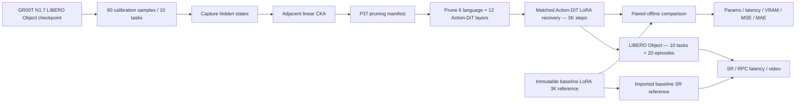
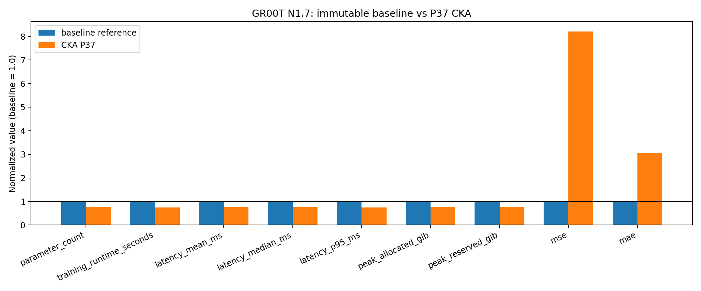
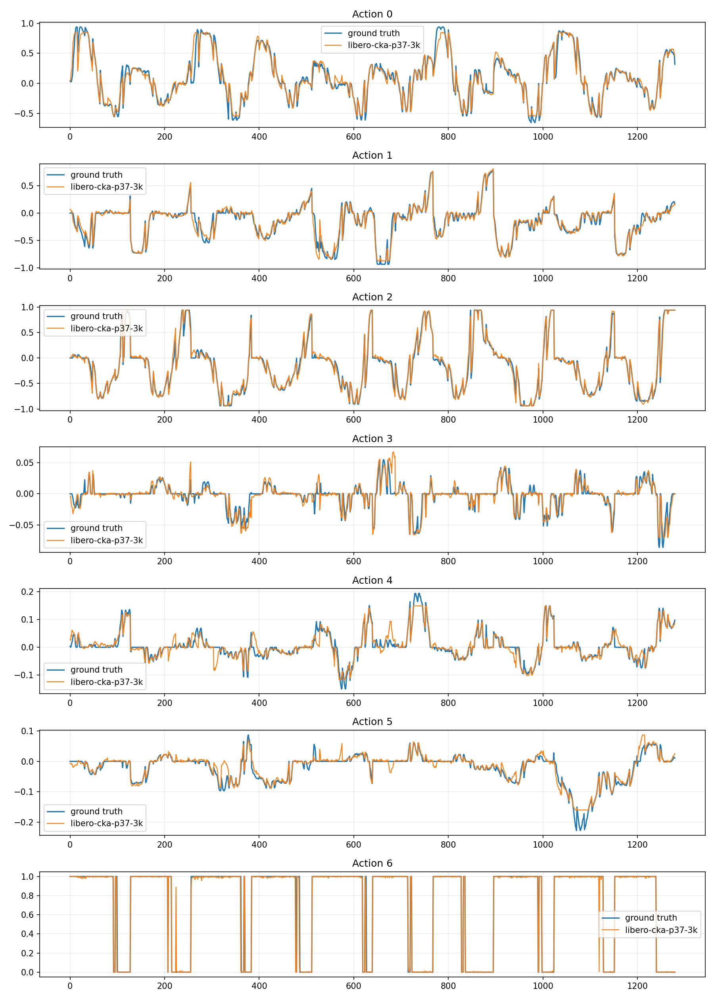
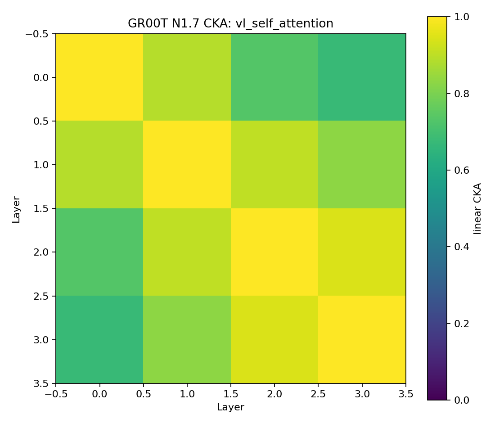
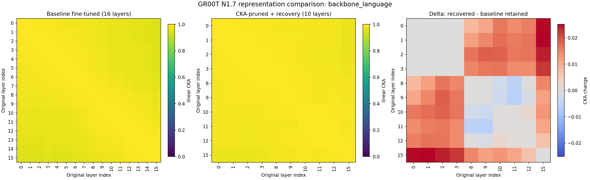
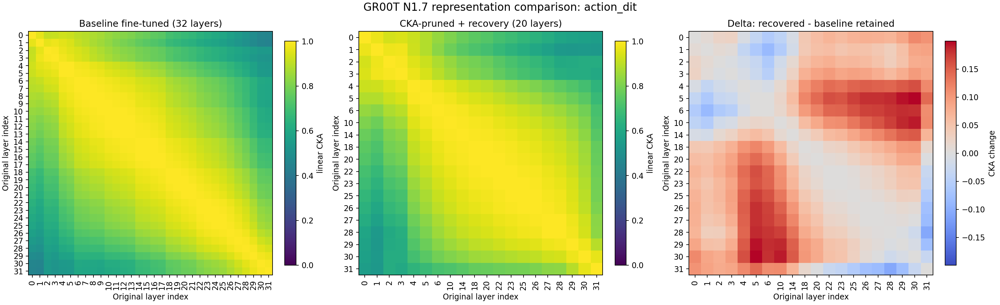
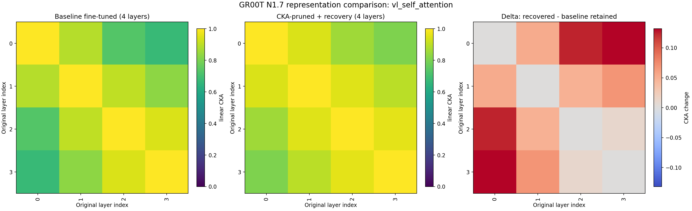
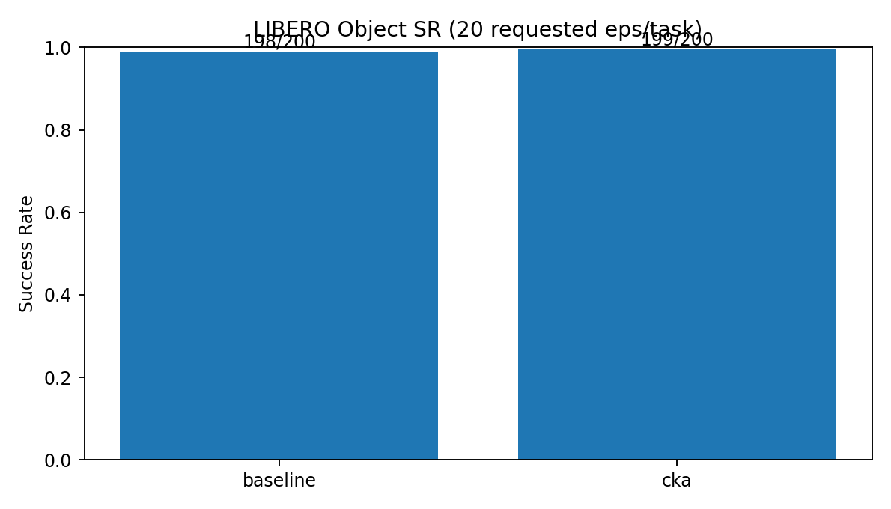
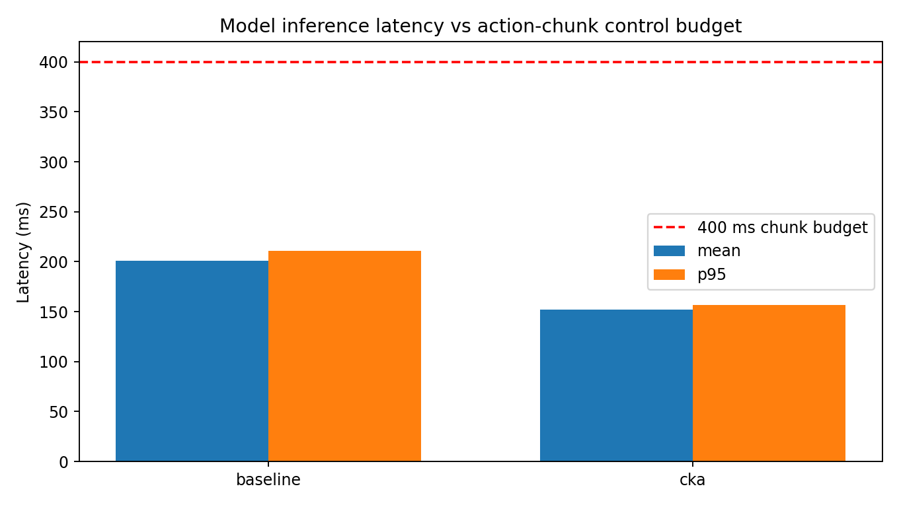
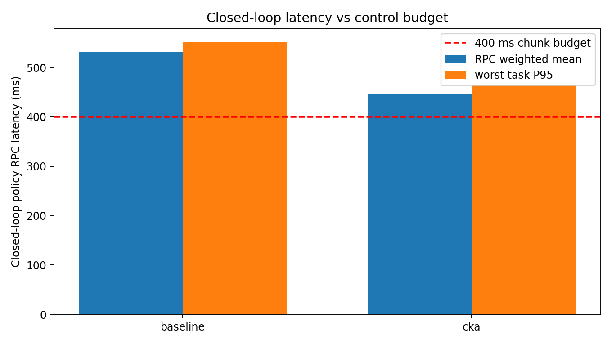

# Báo cáo thí nghiệm GR00T N1.7 — LIBERO Object: CKA P37.5 và matched Action-DiT LoRA recovery

## Tóm tắt điều hành

Thư mục này lưu kết quả của thí nghiệm **structural pruning bằng Centered Kernel Alignment (CKA)** trên **GR00T N1.7 LIBERO Object**, với ngân sách prune **37,5%** cho backbone language và Action-DiT. Mô hình sau pruning được recovery bằng **LoRA trên tất cả Linear module thuộc các Action-DiT block còn lại**, trong khi backbone Qwen3-VL, vision tower, VLLN và base weights của Action-DiT được giữ frozen.

Kết quả chính:

- Pipeline đã hoàn tất: capture hidden states/activations, tính linear CKA, sinh manifest, structural pruning, LoRA recovery 3.000 bước, benchmark offline, heatmap representation sau recovery, full rollout LIBERO Object, latency/control analysis và lưu video.
- P37 loại **6/16 language layers** và **12/32 Action-DiT blocks**; giữ nguyên **4/4 VL self-attention layers**.
- Số tham số giảm từ **3.144.016.000 xuống 2.439.144.064 (−22,42%)**; mean inference latency giảm **24,44%**, P95 giảm **25,74%**, peak allocated VRAM giảm **22,33%**; speedup model-only đạt **1,324×** trên Tesla T4.
- Độ bám action ground truth suy giảm rõ: MSE tăng từ **0,000336 lên 0,002756 (+720,93%)**, MAE tăng từ **0,007415 lên 0,022598 (+204,78%)**. Trên cả 80 cặp validation, P37 nhanh hơn baseline nhưng cũng có MSE và MAE cao hơn baseline.
- Closed-loop LIBERO Object đạt **199/200 = 99,5%**, còn baseline reference đạt **198/200 = 99,0%**. Chênh đúng một episode **không đủ để kết luận P37 chính xác hơn**. Kết luận được phép đưa ra là P37 giữ **functional parity quan sát được trong một lần chạy/một seed**, đồng thời tiết kiệm đáng kể tài nguyên.
- Model-only P95 nằm trong action-chunk budget giả định 400 ms. Tuy nhiên closed-loop policy RPC vẫn vượt budget ở 100% query của cả hai model, nên chưa đạt strict real-time theo giả định 20 Hz và chunk 8 bước.

> **Quy ước:** “baseline” trong báo cáo là immutable reference `gr00t-n1.7-libero-object-baseline-lora-r16-step3000-seed42`, được tạo từ checkpoint LIBERO Object sau matched LoRA recovery 3.000 bước. Baseline **không được train hoặc rollout lại** trong lần chạy P37. “P37” là candidate CKA-pruned 37,5% sau cùng recovery protocol. Đây là post-pruning recovery experiment, không phải reproduction 1:1 quá trình fine-tune GR00T N1.7 từ checkpoint 3B gốc.

---

## 1. Mục tiêu, phạm vi và luồng thí nghiệm

Mục tiêu là kiểm tra mức pruning mạnh hơn P25 có tiếp tục giảm chi phí inference mà vẫn duy trì khả năng hoàn thành task closed-loop hay không.

CKA chỉ là tiêu chí xác định các vùng biểu diễn dư thừa. CKA cao không tự chứng minh một layer “không quan trọng”; quyết định prune phải được kiểm chứng lại bằng độ lệch action, tài nguyên inference và đặc biệt là closed-loop task success.

---

## 2. Thành phần và cấu hình thí nghiệm

### 2.1. Model, dataset và phần cứng

| Hạng mục | Giá trị thực thi |
|---|---|
| Model nguồn | `nvidia/GR00T-N1.7-LIBERO/libero_object` |
| Baseline reference | `gr00t-n1.7-libero-object-baseline-lora-r16-step3000-seed42` |
| Embodiment | `LIBERO_PANDA` |
| Simulator suite | `libero_object`, 10 task pick-and-place |
| Dataset | `IPEC-COMMUNITY/libero_object_no_noops_1.0.0_lerobot` |
| Định dạng | LeRobot: RGB, proprioception, language instruction và Panda actions |
| GPU capture/benchmark | Tesla T4, `cuda:0` |
| PyTorch của capture | `2.9.0+cu128` |
| Seed | 42 |

Dataset là tập LIBERO Object tải từ Hugging Face, không phải `demo_data` nhỏ trong repo. Nguồn capture được ghi tại [`source_calibration/metadata.json`](source_calibration/metadata.json).

### 2.2. Tách calibration và offline validation

| Tập | Trajectory IDs | Lấy mẫu | Tổng mẫu |
|---|---|---:|---:|
| CKA calibration | 0, 1, 3, 4, 6, 7, 9, 12, 14, 16 | 8 mẫu/trajectory, stride 8 | 80 |
| Offline validation | 22, 2, 49, 5, 11, 10, 15, 20, 23, 19 | 8 mẫu/trajectory, stride 8 | 80 |

Hai danh sách trajectory không giao nhau và được chọn theo task để phủ đủ 10 object tasks. Capture và benchmark đều dùng 4 denoising steps; benchmark có 2 warmup steps.

Đây là tách biệt ở cấp trajectory, nhưng calibration, recovery và validation vẫn thuộc cùng một dataset/suite. Vì vậy MSE/MAE là diagnostic offline có kiểm soát, chưa phải bằng chứng generalization sang distribution mới.

### 2.3. Cấu hình CKA và layer bị prune

Nguồn chuẩn là [`source_cka_analysis/pruning_manifest.json`](source_cka_analysis/pruning_manifest.json) và [`source_cka_analysis/cka_report.json`](source_cka_analysis/cka_report.json).

| Module | Độ sâu gốc | Giữ | Loại | Prune thực tế | Adjacent CKA: min / mean / max |
|---|---:|---:|---:|---:|---:|
| Backbone language | 16 | 10 | 6 | 37,5% | 0,99494 / 0,99699 / 0,99856 |
| Action-DiT | 32 | 20 | 12 | 37,5% | 0,96167 / 0,99295 / 0,99938 |
| VL self-attention | 4 | 4 | 0 | 0% | 0,89027 / 0,91288 / 0,94513 |

| Module | Layer giữ lại | Layer bị prune |
|---|---|---|
| Backbone language | 0, 1, 2, 3, 8, 9, 10, 11, 12, 15 | **4, 5, 6, 7, 13, 14** |
| Action-DiT | 0–6, 10, 14, 18, 20, 22, 23, 25–31 | **7, 8, 9, 11, 12, 13, 15, 16, 17, 19, 21, 24** |
| VL self-attention | 0, 1, 2, 3 | — |

Tên P37/P37.5 mô tả tỷ lệ prune của hai stack được chọn, không phải tỷ lệ giảm của toàn model. Do vision, VLLN, encoder/decoder và các thành phần khác không bị prune, tổng parameter count giảm **22,42%**, thấp hơn 37,5%.

### 2.4. Matched Action-DiT LoRA recovery

Nguồn chuẩn là [`recovery_contract.json`](recovery_contract.json).

| Hạng mục | Cấu hình P37 |
|---|---|
| Protocol | `matched_action_dit_lora_recovery_v1` |
| Recovery steps | 3.000 |
| Batch / gradient accumulation | 1 / 8; effective batch 8 |
| Learning rate | `1e-4` |
| State dropout | 0,2 |
| LoRA | rank 16, alpha 32, dropout 0,05 |
| Target | Mọi `Linear` module trong 20 Action-DiT block còn lại |
| Fully trainable | LoRA A/B, `timestep_encoder`, `proj_out_1`, `proj_out_2` |
| Frozen | Qwen3-VL language, vision tower, VLLN, base Action-DiT weights, state/action encoder-decoder, position embedding |
| Activation checkpointing | Bật |
| Checkpoint | Adapter-only để resume; LoRA merge khi final export |

Log xác nhận cấu hình thực tế:

| Chỉ số | P37 |
|---|---:|
| Retained Action-DiT blocks | 20 |
| Linear modules gắn LoRA | 140 |
| LoRA trainable parameters | 10.518.528 |
| Tổng trainable parameters trong recovery | 19.569.664 |
| Final merged Linear modules | 140 |

Nguồn: [`logs/LoRA_recovery_cka_p37_to_step_3000.log`](logs/LoRA_recovery_cka_p37_to_step_3000.log).

Recovery được chia thành các stage có resume. Tổng wall-clock của các stage hoàn thành là **9.902,13 s (2,75 giờ)**; lần smoke 0→10 bị lỗi sau khi đã tạo checkpoint và tiêu tốn 154,44 s nhưng không được cộng vào metric này. Baseline reference ghi **13.159,51 s (3,66 giờ)**. Chênh lệch −24,75% có giá trị vận hành, nhưng không phải pure optimizer benchmark vì số lần load/export và ranh giới session khác nhau. Lịch sử nằm tại [`recovery_stage_history.json`](recovery_stage_history.json).

---

## 3. Đối chiếu với protocol LIBERO chính thức của repo

Hai báo cáo trước đã đối chiếu snapshot repo với recipe LIBERO Object: bắt đầu từ `nvidia/GR00T-N1.7-3B`, 8 GPU, global batch 640, 20.000 steps, state dropout 0,2 và đánh giá 10 task × 20 episode. P37 giữ đúng phần data/evaluation quan trọng, nhưng recovery được thu nhỏ để chạy ổn định trên Kaggle T4.

| Tiêu chí | Recipe/reported protocol của repo | Thí nghiệm P37 | Đánh giá |
|---|---|---|---|
| Dataset | LIBERO Object no-noops LeRobot | Đúng dataset và `LIBERO_PANDA` | Đạt |
| Model bắt đầu cho reproduction | `nvidia/GR00T-N1.7-3B` | Checkpoint `N1.7-LIBERO/libero_object` đã fine-tuned | Khác mục tiêu; là recovery experiment |
| GPU | 8 GPU | Kaggle Tesla T4; một GPU cho model process | Không tái lập phần cứng repo |
| Global batch | 640 | Effective batch 8 | Nhỏ hơn 80 lần |
| Max steps | 20.000 | 3.000 | 15% số optimizer steps |
| Fine-tuning | Full recipe của repo | LoRA trên retained Action-DiT + small modules | PEFT, không phải full fine-tune |
| State dropout | 0,2 | 0,2 | Đạt |
| Closed-loop suite | 10 task × 20 episode = 200/model | Baseline reference 200 + P37 200 | Đạt episode accounting |
| `n_envs`, horizon, action steps | Repo LIBERO rollout | 5, 720, 8 | Đạt cấu hình đã dùng trong reference |
| Seed / uncertainty | Cần lặp để claim thống kê | Một seed 42 | Chưa đủ |

Kết luận đúng phạm vi:

> Đây là thí nghiệm CKA-pruning + LoRA recovery hoàn chỉnh với full LIBERO Object evaluation trong giới hạn Kaggle T4; không phải reproduction 1:1 recipe huấn luyện NVIDIA.

---

## 4. Kết quả benchmark offline

Nguồn chuẩn:

- [`final_comparison/comparison.json`](final_comparison/comparison.json)
- [`eval_baseline_reference/summary.json`](eval_baseline_reference/summary.json)
- [`eval_cka_p37/summary.json`](eval_cka_p37/summary.json)
- [`final_comparison/paired_offline.csv`](final_comparison/paired_offline.csv)

| Metric | Baseline reference | P37 | Thay đổi P37 | Diễn giải |
|---|---:|---:|---:|---|
| Parameter count | 3.144.016.000 | 2.439.144.064 | **−22,42%** | Structural pruning có hiệu lực thật |
| Model load time | 57,49 s | 29,52 s | **−48,65%** | Candidate load nhanh hơn trong hai lần đo; nhạy với cache/I/O |
| Recovery wall-clock | 13.159,51 s | 9.902,13 s | **−24,75%** | Có overhead session; không phải pure training time |
| Mean latency | 200,99 ms | 151,86 ms | **−24,44%** | Speedup rõ và ổn định |
| Median latency | 200,07 ms | 151,09 ms | **−24,48%** | Gain không chỉ do outlier |
| P95 latency | 210,70 ms | 156,47 ms | **−25,74%** | Tail latency cải thiện mạnh |
| Peak allocated VRAM | 5,949 GiB | 4,620 GiB | **−22,33%** | Tiết kiệm khoảng 1,328 GiB |
| Peak reserved VRAM | 6,039 GiB | 4,719 GiB | **−21,86%** | Giảm memory reserve |
| Offline MSE | 0,000336 | 0,002756 | **+720,93%** | P37 bằng 8,21× baseline |
| Offline MAE | 0,007415 | 0,022598 | **+204,78%** | P37 bằng 3,05× baseline |

Inference speedup tổng hợp là **1,324×**. Trên **80/80** cặp validation, P37 có latency thấp hơn baseline; đồng thời **80/80** cặp có MSE và MAE cao hơn. Vì vậy cả gain hiệu năng lẫn degradation offline đều là xu hướng nhất quán trên tập đo, không phải kết quả của vài outlier.

Biểu đồ thể hiện trade-off rất rõ: các metric tài nguyên đều xuống dưới baseline 1,0, trong khi MSE tăng lên 8,21 lần và MAE tăng lên 3,05 lần. P37 không phải “compression miễn phí”.

### Prediction so với ground truth

P37 vẫn bám được hình dạng tổng quát, các plateau, chuyển pha và trạng thái gripper ở nhiều đoạn trên bảy action dimensions. Sai khác tập trung ở biên chuyển động nhanh, biên độ nhỏ và thời điểm chuyển trạng thái; điều này phù hợp với MSE/MAE tăng mạnh.

Gói P37 không lưu raw prediction tensor hoặc plot của baseline 3K. Vì vậy `prediction_drift_mse` và `prediction_drift_mae` trong comparison là `null`; không nên dựng claim “P37 gần baseline ở mức X” ngoài hai metric cùng so với ground truth. Baseline per-step chỉ giữ latency/VRAM/MSE/MAE, không đủ tái tạo đường action baseline.

---

## 5. Phân tích CKA và representation

### 5.1. Source CKA trước pruning

| Backbone language | Action-DiT | VL self-attention |
|---|---|---|
|  |  |  |

Backbone language gần như một màu vì CKA giữa các layer rất cao: adjacent CKA từ 0,99494 đến 0,99856. Đây không phải lỗi heatmap. Action-DiT có cấu trúc dải chéo: layer gần nhau tương đồng cao, nhưng các vùng đầu/cuối khác nhau rõ hơn. Điều này ủng hộ pruning theo redundancy cục bộ thay vì bỏ block ngẫu nhiên.

Các bản dễ quan sát chênh lệch nhỏ:

- [`source_cka_analysis/backbone_language_cka_zoom.png`](source_cka_analysis/backbone_language_cka_zoom.png)
- [`source_cka_analysis/action_dit_cka_zoom.png`](source_cka_analysis/action_dit_cka_zoom.png)
- [`source_cka_analysis/vl_self_attention_cka_zoom.png`](source_cka_analysis/vl_self_attention_cka_zoom.png)
- [`source_cka_analysis/backbone_language_cka_distance.png`](source_cka_analysis/backbone_language_cka_distance.png)
- [`source_cka_analysis/action_dit_cka_distance.png`](source_cka_analysis/action_dit_cka_distance.png)
- [`source_cka_analysis/vl_self_attention_cka_distance.png`](source_cka_analysis/vl_self_attention_cka_distance.png)

### 5.2. Representation sau pruning + recovery

| Module | Source retained off-diagonal | P37 recovered off-diagonal | Adjacent: source retained → P37 | Mean absolute delta |
|---|---:|---:|---:|---:|
| Backbone language | 0,97741 | 0,98725 | 0,99406 → 0,99620 | **0,00957** |
| Action-DiT | 0,78735 | 0,84559 | 0,98629 → 0,98799 | **0,06716** |
| VL self-attention | 0,82895 | 0,90203 | 0,91288 → 0,95077 | **0,05481** |

| Backbone language | Action-DiT | VL self-attention |
|---|---|---|
|  |  |  |

Nguồn số: [`heatmap_comparison/cka_before_after_summary.json`](heatmap_comparison/cka_before_after_summary.json).

Backbone language thay đổi ít nhất. Action-DiT có delta lớn nhất, phù hợp với việc bị loại 12 block và là nơi LoRA recovery trực tiếp thích nghi. VL self-attention không bị prune nhưng vẫn đổi do input upstream và policy recovery thay đổi.

**Giới hạn provenance quan trọng:** [`heatmap_comparison/comparison_scope.json`](heatmap_comparison/comparison_scope.json) xác nhận “baseline representation” trong heatmap là **original pretrained source before pruning**, còn optimized representation là **P37 sau 3K recovery**. Nó **không phải** immutable baseline LoRA 3K dùng trong bảng benchmark. Do đó heatmap này chứng minh representation P37 không sụp đổ và cho thấy nơi thay đổi tập trung; nó không đo trực tiếp khoảng cách P37 với baseline recovery 3K.

---

## 6. Closed-loop LIBERO Object success rate

[`success_rate/full_sr_validation.json`](success_rate/full_sr_validation.json) xác nhận protocol `repo_full`: 10 task × 20 episode/model. Baseline 200 episode được nhập từ immutable reference; lần chạy P37 rollout 200 episode candidate. Bảng tổng hợp có 400 scored episodes, nhưng không nên diễn giải là cả hai model đều được chạy lại trong cùng session.

### 6.1. Aggregate

| Model | Successes | Episodes | Success rate | Wilson 95% CI |
|---|---:|---:|---:|---:|
| Baseline recovery 3K reference | 198 | 200 | **99,0%** | 96,43%–99,73% |
| P37 + LoRA recovery 3K | 199 | 200 | **99,5%** | 97,22%–99,91% |

Hai khoảng tin cậy chồng lấp rất mạnh. Chênh lệch **1 success / 200 episode = 0,5 điểm phần trăm** là quá nhỏ để xếp hạng chất lượng. Với một seed, kết luận đúng là **không quan sát thấy suy giảm closed-loop có ý nghĩa ở P37**, không phải “P37 tốt hơn baseline”.

### 6.2. Theo task

| Task | Baseline | P37 | Ghi chú |
|---|---:|---:|---|
| Alphabet soup | 20/20 | 20/20 | Không ghi nhận fail |
| Cream cheese | 20/20 | 20/20 | Không ghi nhận fail |
| Salad dressing | 20/20 | 20/20 | Không ghi nhận fail |
| BBQ sauce | 20/20 | 20/20 | Không ghi nhận fail |
| Ketchup | 20/20 | 20/20 | Không ghi nhận fail |
| Tomato sauce | 20/20 | 20/20 | Không ghi nhận fail |
| Butter | 19/20 | 20/20 | Chênh 1 episode; không đủ kết luận P37 tốt hơn |
| Milk | 20/20 | 20/20 | Không ghi nhận fail |
| Chocolate pudding | 19/20 | 19/20 | Cả hai ghi nhận 1 fail |
| Orange juice | 20/20 | 20/20 | Không ghi nhận fail |

P37 hoàn thành 9/10 task ở mức 20/20 và một task ở mức 19/20. Baseline có hai task 19/20. Phân bố fail cho thấy policy nhìn chung ổn định trong suite này, nhưng mỗi task chỉ có 20 episode; một fail riêng lẻ có thể do initial state, stochastic sampling hoặc tương tác simulator. Không dùng các chênh lệch 1/20 để tuyên bố task-level superiority.

### 6.3. Video rollout

Thư mục [`selected_videos/`](selected_videos/) chứa **30 MP4 của P37**, tức 3 preview/task. Episode fail được ưu tiên:

- [P37 chocolate pudding — fail](selected_videos/08_pick_up_the_chocolate_pudding_and_place_it_in_the_basket/video_pick_up_the_chocolate_pudding_and_place_it_in_the_basket_cka_fail_01.mp4)
- [P37 chocolate pudding — success 02](selected_videos/08_pick_up_the_chocolate_pudding_and_place_it_in_the_basket/video_pick_up_the_chocolate_pudding_and_place_it_in_the_basket_cka_success_02.mp4)
- [P37 BBQ sauce — success 01](selected_videos/03_pick_up_the_bbq_sauce_and_place_it_in_the_basket/video_pick_up_the_bbq_sauce_and_place_it_in_the_basket_cka_success_01.mp4)

[`success_rate/all_rollout_videos_summary.json`](success_rate/all_rollout_videos_summary.json) ghi nhận đúng **200 raw P37 videos**, gồm 199 success và 1 fail, tổng khoảng 0,0595 GiB. Baseline videos không nằm trong package P37. Full raw-video ZIP đã tồn tại ở `/tmp` khi tạo artifact nhưng bị loại khỏi final results package; chỉ inventory, checksum reference và 30 preview được giữ. Vì vậy báo cáo có thể audit định tính P37, nhưng không thể review trực tiếp video baseline từ thư mục này.

---

## 7. Latency và control budget

Giả định phân tích: control frequency 20 Hz, mỗi control step 50 ms, một policy query sinh action chunk 8 bước; vì vậy action-chunk deadline là **8 × 50 = 400 ms**. Đây là giả định deployment, không phải tần số wall-clock đo trực tiếp từ LIBERO.

### 7.1. Model-only inference

| Model | Mean | P95 | Headroom so với 400 ms | P95 utilization | Kết quả |
|---|---:|---:|---:|---:|---|
| Baseline | 200,99 ms | 210,70 ms | 189,30 ms | 52,67% | Đạt model-only chunk deadline |
| P37 | 151,86 ms | 156,47 ms | 243,53 ms | 39,12% | Đạt; headroom tốt hơn |

P37 giảm mean 24,44% và P95 25,74%. P95 chỉ cao hơn mean khoảng 3,0%, cho thấy tail latency model-only khá gọn trong lần benchmark này.

### 7.2. Closed-loop policy RPC và rollout throughput

| Metric | Baseline reference | P37 | Thay đổi P37 |
|---|---:|---:|---:|
| Policy RPC weighted mean | 530,96 ms | 447,09 ms | **−15,80%** |
| Worst-task RPC P95 | 551,25 ms | 465,38 ms | **−15,58%** |
| Worst-task RPC P99 | 582,48 ms | 504,07 ms | **−13,46%** |
| Deadline miss rate | 100% | 100% | Không đổi |
| End-to-end env steps/s | 6,009 | 5,977 | −0,53% |
| Rollout wall-clock / 200 episode | 4.772,05 s | 4.804,14 s | +0,67% |

Model-only inference nhanh hơn mạnh, và RPC latency cũng giảm. Tuy nhiên serialization, network/process boundary, preprocessing và server overhead làm RPC của cả hai model vượt 400 ms. P37 không làm end-to-end rollout nhanh hơn vì simulator stepping, episode length và video encoding chiếm phần đáng kể. Success rate cao chỉ cho biết rollout synchronous có thể chờ policy; nó không chứng minh strict real-time 20 Hz.

---

## 8. Điều đã chứng minh và giới hạn

### Có thể kết luận

1. Structural pruning đã xảy ra thật: depth giảm đúng manifest, parameter count, latency và VRAM giảm đồng bộ.
2. P37 là mức compression mạnh hơn P25 và đem lại gain lớn: −22,42% params, −24,44% mean latency, −25,74% P95, −22,33% peak VRAM.
3. Gain latency ổn định trên 80/80 paired offline samples; đây là bằng chứng mạnh hơn chỉ nhìn mean.
4. P37 giữ 199/200 closed-loop successes trong full LIBERO Object rollout của candidate.
5. Recovery LoRA cho phép retained Action-DiT thích nghi với việc bỏ 12 block mà không làm task success sụp đổ trong lần chạy này.

### Chưa thể kết luận

1. Không thể nói P37 chính xác hơn baseline từ chênh một episode; dữ liệu chỉ hỗ trợ kết luận parity quan sát được.
2. Không thể chứng minh 37,5% là mức prune tối đa an toàn. Cần nhiều seed và ít nhất một điểm prune cao hơn/thấp hơn với protocol cố định để xác định biên Pareto.
3. Offline MSE/MAE xấu hơn trên 80/80 mẫu; P37 không giữ pointwise action fidelity, dù giữ task success.
4. Một seed không đủ đánh giá robustness hoặc statistical significance. Wilson intervals của baseline và P37 chồng lấp mạnh.
5. Baseline dùng immutable reference thay vì rerun đồng thời. Protocol offline/hardware được khóa giống nhau, nhưng session timing, cache và môi trường runtime không hoàn toàn đồng nhất.
6. Heatmap recovered dùng source checkpoint trước pruning, không dùng baseline LoRA 3K; không được coi đó là direct baseline-vs-P37 representation comparison.
7. Đây không phải reproduction full 8-GPU/20K/global-batch-640 của repo và chưa phải robot thật.

---

## 9. Bản đồ artifact

| Đường dẫn | Nội dung |
|---|---|
| [`baseline_reference.json`](baseline_reference.json) | Baseline bất biến, protocol và provenance |
| [`source_calibration/metadata.json`](source_calibration/metadata.json) | Trajectory/sample capture hidden states |
| [`source_cka_analysis/`](source_cka_analysis/) | CKA report, heatmap, contrast map và pruning manifest |
| [`recovery_contract.json`](recovery_contract.json) | Matched LoRA recovery contract |
| [`recovery_stage_history.json`](recovery_stage_history.json) | Lịch sử stage/resume và wall-clock |
| [`logs/`](logs/) | Log setup, CKA, recovery, benchmark |
| [`eval_baseline_reference/`](eval_baseline_reference/) | Summary/per-step baseline nhập từ reference |
| [`eval_cka_p37/`](eval_cka_p37/) | Summary/per-step/plot P37 |
| [`final_comparison/`](final_comparison/) | So sánh paired offline và biểu đồ chuẩn hóa |
| [`heatmap_comparison/`](heatmap_comparison/) | Source-vs-recovered representation maps và scope |
| [`control_latency/`](control_latency/) | Model-only latency/control analysis |
| [`success_rate/`](success_rate/) | Full SR, per-task, aggregate, RPC latency, video inventory |
| [`selected_videos/`](selected_videos/) | 30 preview P37, ưu tiên fail |
| [`final_archive_manifest.json`](final_archive_manifest.json) | Phạm vi file được đóng gói và những phần bị loại |
| [`prior_report/freeze-report.md`](prior_report/freeze-report.md) | Báo cáo frozen-DiT 1K trước đó |
| [`prior_report/p25-report.md`](prior_report/p25-report.md) | Báo cáo matched LoRA P25 3K trước đó |

---

## 10. So sánh cuối: baseline, frozen recovery, P25 và P37

### 10.1. Bảng tổng hợp các thế hệ

| Phiên bản | Prune language / DiT | Recovery | Params giảm | Mean latency giảm | P95 giảm | Peak VRAM giảm | MSE so baseline | MAE so baseline | Closed-loop SR |
|---|---:|---|---:|---:|---:|---:|---:|---:|---:|
| Baseline LoRA 3K reference | 0 / 0 | Matched LoRA 3K | 0% | 0% | 0% | 0% | 0,000336 | 0,007415 | 198/200 (99,0%) |
| Frozen-DiT 1K | 2/16 / 5/32 | Projector-only; DiT frozen | −8,56% | −11,64% | −12,77% | −8,54% | +83,71%* | +32,09%* | 193/200 (96,5%)* |
| P25 LoRA 3K | 4/16 / 8/32 | Matched Action-DiT LoRA | −14,91% | −15,76% | −17,28% | −14,89% | +276,00% | +83,98% | 199/200 (99,5%) |
| **P37 LoRA 3K** | **6/16 / 12/32** | Matched Action-DiT LoRA | **−22,42%** | **−24,44%** | **−25,74%** | **−22,33%** | **+720,93%** | **+204,78%** | **199/200 (99,5%)** |

\* Frozen-DiT dùng baseline/recovery/offline sample protocol khác và baseline rollout bị overshoot 201 episode; chỉ nên dùng như bằng chứng lịch sử rằng projector-only recovery không đủ tốt, không dùng để xếp hạng định lượng trực tiếp với P25/P37.

P25 và P37 dùng cùng immutable baseline reference, cùng 80 validation samples, cùng seed/hardware class và cùng LoRA 3K contract; so sánh giữa hai điểm này đáng tin cậy hơn so với frozen-DiT.

### 10.2. P37 thay đổi gì so với P25?

| Metric | P25 | P37 | P37 so với P25 |
|---|---:|---:|---:|
| Parameter count | 2,675B | 2,439B | **−8,82%** |
| Mean model latency | 169,31 ms | 151,86 ms | **−10,31%** |
| P95 model latency | 174,28 ms | 156,47 ms | **−10,22%** |
| Peak allocated VRAM | 5,063 GiB | 4,620 GiB | **−8,74%** |
| Policy RPC weighted mean | 474,57 ms | 447,09 ms | **−5,79%** |
| Policy RPC worst-task P95 | 495,09 ms | 465,38 ms | **−6,00%** |
| Offline MSE | 0,001262 | 0,002756 | **+118,40%** |
| Offline MAE | 0,013641 | 0,022598 | **+65,66%** |
| Success rate | 199/200 | 199/200 | Không đổi về aggregate |
| End-to-end env steps/s | 6,052 | 5,977 | −1,24% |

P37 tiếp tục cải thiện đều model size, VRAM và latency. Đổi lại, offline action error tăng nhanh hơn gain tài nguyên: MSE hơn gấp đôi P25 và MAE tăng khoảng hai phần ba. Đây là dấu hiệu lợi ích compression bắt đầu đi kèm mất fidelity lớn hơn.

### 10.3. Độ chính xác và độ ổn định

- **Success rate:** baseline 198/200, P25 199/200 và P37 199/200 không tạo ra thứ hạng chất lượng đáng tin cậy. Mỗi model chỉ lệch 1–2 fail trên 200 episode và chỉ có một seed. P25 fail ở butter; P37 fail ở chocolate pudding. Việc fail “dịch task” nhưng aggregate không đổi càng cho thấy nhiễu rollout có thể chi phối các chênh lệch nhỏ.
- **Offline fidelity:** degradation là nhất quán và có ý nghĩa thực nghiệm hơn: P37 có MSE/MAE xấu hơn baseline trên cả 80/80 paired samples. Vì vậy không được nói P37 “giữ nguyên độ chính xác” theo nghĩa pointwise action prediction.
- **Latency stability:** P37 nhanh hơn baseline trên 80/80 paired samples; median, mean và P95 cùng giảm khoảng 24–26%. Đây là gain ổn định nhất của P37.
- **Representation stability:** mean absolute delta của P37 là 0,00957 ở language, 0,06716 ở Action-DiT và 0,05481 ở VLSA. So với P25 (0,00728 / 0,03407 / 0,03382), drift tăng rõ, đặc biệt Action-DiT gần gấp đôi. Điều này phù hợp với offline error tăng.
- **Control stability:** model-only đáp ứng budget 400 ms với headroom lớn hơn, nhưng RPC miss rate vẫn 100%. Compression chưa giải quyết toàn bộ bottleneck hệ thống.

### 10.4. Đánh giá trade-off và chất lượng tối ưu

| Khía cạnh | Đánh giá P37 |
|---|---|
| Hiệu quả nén | **Tốt nhất trong ba candidate đã báo cáo**: giảm 22,42% tham số |
| Tốc độ model | **Cải thiện mạnh và nhất quán**: 1,324×; P95 −25,74% |
| Bộ nhớ | **Cải thiện mạnh**: peak allocated −22,33% |
| Task completion quan sát được | **Giữ parity trong lần chạy này**: 199/200, nhưng chưa có ý nghĩa hơn baseline/P25 |
| Pointwise action fidelity | **Suy giảm đáng kể**: MSE 8,21× và MAE 3,05× baseline |
| Representation | Không sụp đổ, nhưng drift Action-DiT/VLSA cao hơn P25 |
| Real-time deployment | Model-only đạt budget giả định; closed-loop RPC chưa đạt |
| Độ chắc chắn thống kê | Thấp: một seed, 20 episode/task, baseline nhập từ reference |

**Kết luận cuối:** P37 là điểm **compression–latency mạnh nhất** trong các kết quả hiện có và vẫn giữ mức task success quan sát được rất cao. Nếu mục tiêu ưu tiên giảm model size/VRAM/latency mà chấp nhận action trajectory không còn bám sát baseline, P37 là candidate hấp dẫn hơn P25. Tuy nhiên, P37 **chưa được chứng minh là chính xác hơn**, **chưa được chứng minh ổn định ngang baseline qua nhiều seed**, và **chưa được chứng minh là tỷ lệ prune tối đa có trade-off an toàn**. Claim phù hợp nhất là:

> Với một seed trên LIBERO Object, CKA P37.5 + matched LoRA recovery 3K giảm khoảng 22–26% chi phí model và giữ 199/200 task successes; đổi lại offline action fidelity suy giảm mạnh. P37 mở rộng Pareto frontier về hiệu năng trong dữ liệu hiện có, nhưng cần lặp nhiều seed để xác nhận parity và xác định biên pruning tối đa.

