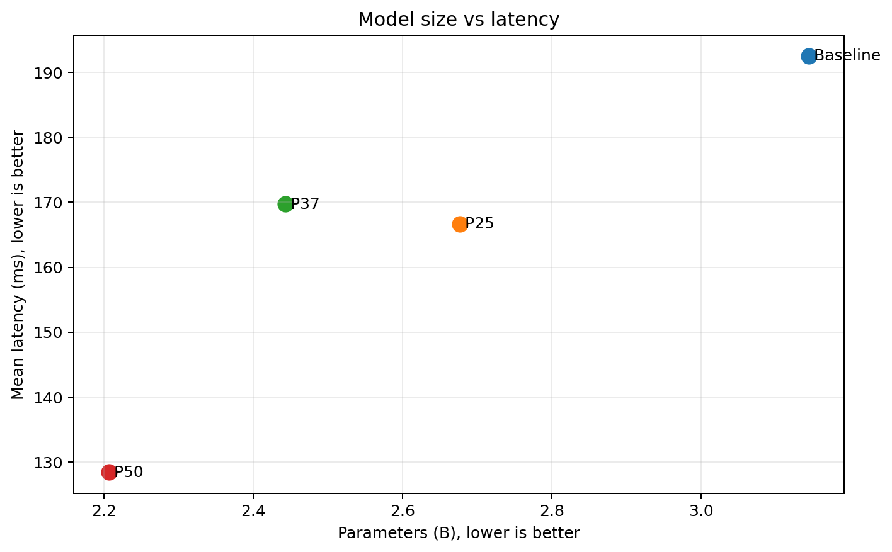
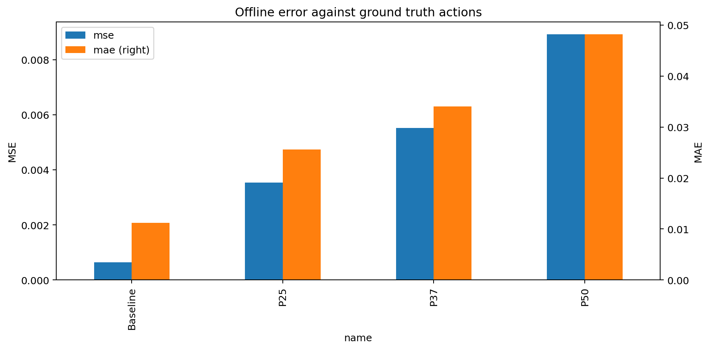
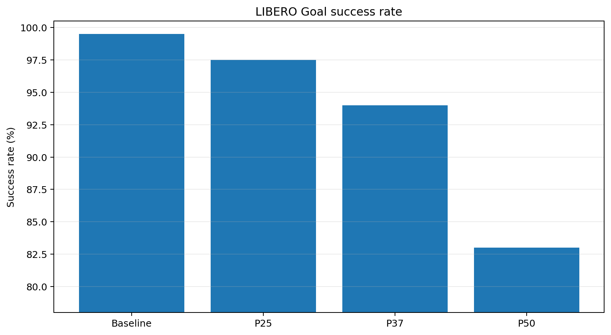
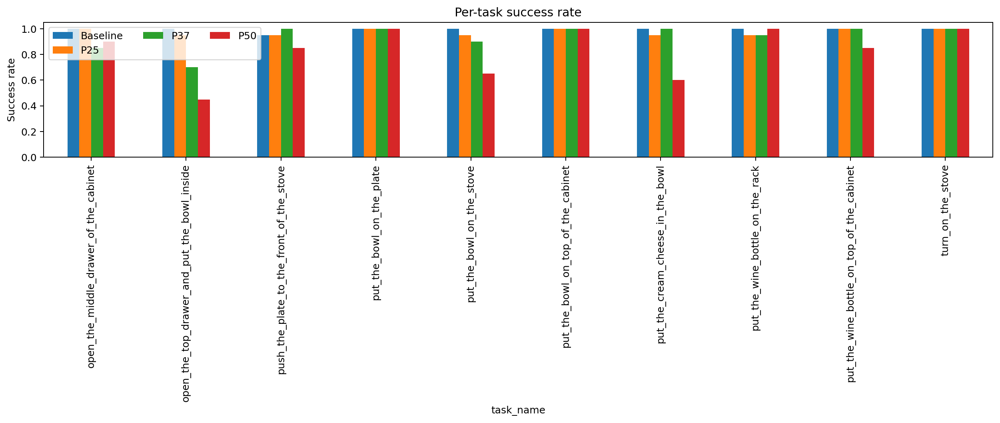
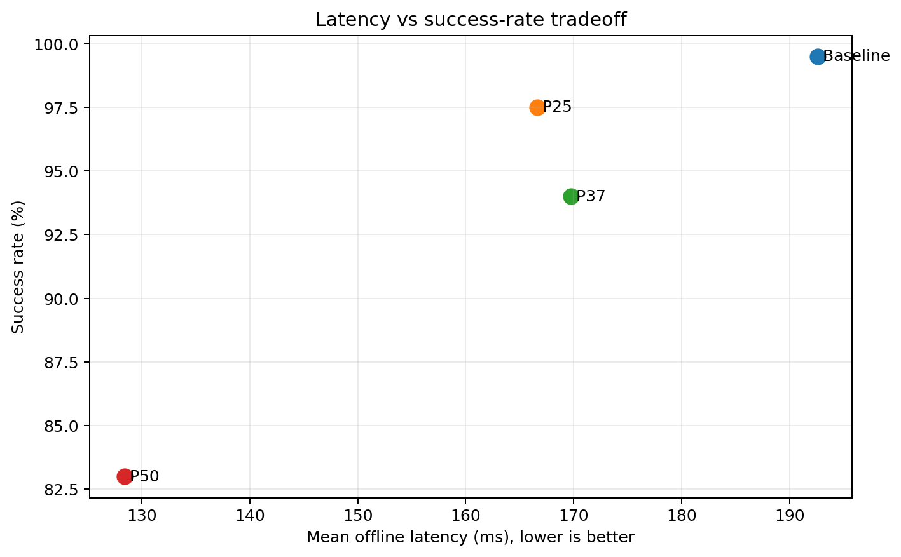

# GR00T-N1.7 — CKA pruning trên LIBERO Goal

## 1. Mục tiêu

Thí nghiệm đánh giá ảnh hưởng của **CKA-guided layer pruning** lên GR00T-N1.7 trong LIBERO Goal. Khác với Object, suite này yêu cầu mô hình hoàn thành mục tiêu gồm nhiều quan hệ giữa thao tác, vật thể và trạng thái môi trường; vì vậy độ chính xác có thể suy giảm sớm khi language backbone hoặc Action-DiT bị rút gọn.

Baseline được so sánh với `P25`, `P37.5` và `P50` theo parameters, latency, VRAM, MSE/MAE và success rate closed-loop. Mục tiêu là xác định giới hạn pruning trước khi lợi ích tài nguyên không còn bù được suy giảm task accuracy.

## 2. Ý nghĩa mức pruning và số lớp bị cắt

Hidden activations của baseline được dùng để tính CKA. Các layer có biểu diễn tương đồng/dư thừa được xếp hạng để chọn danh sách giữ lại; phương pháp không đơn giản cắt liên tiếp các layer cuối.

Tỷ lệ `Pxx` chỉ áp dụng cho language backbone và Action-DiT. Bốn layer VL self-attention (VLSA) được giữ nguyên, nên tỷ lệ giảm parameters toàn mô hình thấp hơn pruning rate danh nghĩa.

| Phiên bản | Ý nghĩa | Language | Action-DiT | VLSA | Layer bị cắt | Giảm parameters toàn model |
|---|---|---:|---:|---:|---:|---:|
| Baseline | Không pruning | 16/16 | 32/32 | 4/4 | 0 | 0% |
| P25 | Pruning bảo thủ | 12/16 | 24/32 | 4/4 | 4 language + 8 DiT | 14.86% |
| P37.5 (`P37`) | Pruning trung bình | 10/16 | 20/32 | 4/4 | 6 language + 12 DiT | 22.32% |
| P50 | Pruning mạnh | 8/16 | 16/32 | 4/4 | 8 language + 16 DiT | 29.83% |

Compact result chỉ lưu số lượng lớp giữ/cắt, không chứa `pruning_manifest.json`; báo cáo vì vậy không suy đoán index cụ thể của từng layer. Exact keep/prune indices cần lấy từ full experiment archive.

## 3. Cấu hình đánh giá

- Suite: `LIBERO Goal`, 10 task.
- Closed-loop rollout: 20 episode/task, tổng 200 episode/phiên bản.
- Candidate recovery: Action-DiT LoRA rank 16, 3.000 bước, seed 42.
- Chỉ tiêu: parameters, model-load time, offline latency mean/P95, peak VRAM, MSE/MAE, policy RPC latency và success rate.
- Control deadline tham chiếu: 400 ms/action chunk.

## 4. So sánh toàn bộ chỉ số

| Chỉ số | Baseline | P25 | P37.5 | P50 |
|---|---:|---:|---:|---:|
| Parameters | 3.144B | 2.677B | 2.442B | 2.206B |
| Giảm parameters | 0% | 14.86% | 22.32% | 29.83% |
| Trainable parameters ghi nhận | 1.621B | 1.153B | 1.019B | 0.884B |
| Model load (s) | 68.478 | 59.342 | 19.464 | 43.621 |
| Offline latency mean (ms) | 192.578 | 166.656 | 169.731 | 128.384 |
| Offline latency P95 (ms) | 196.756 | 174.565 | 179.440 | 135.880 |
| Latency speedup | 1.000× | 1.156× | 1.135× | 1.500× |
| Peak allocated VRAM (GiB) | 5.947 | 5.064 | 4.625 | 4.180 |
| Peak reserved VRAM (GiB) | 6.076 | 5.217 | 4.758 | 4.318 |
| MSE | 0.000644 | 0.003535 | 0.005524 | 0.008925 |
| MSE / baseline | 1.00× | 5.49× | 8.57× | 13.85× |
| MAE | 0.011211 | 0.025609 | 0.034058 | 0.048202 |
| MAE / baseline | 1.00× | 2.28× | 3.04× | 4.30× |
| Successes / 200 | 199 | 195 | 188 | 166 |
| Success rate | 99.5% | 97.5% | 94.0% | 83.0% |
| SR delta so với baseline | 0 điểm | −2.0 điểm | −5.5 điểm | −16.5 điểm |
| Policy RPC mean (ms) | 509.084 | 501.892 | 499.219 | 456.300 |
| RPC cải thiện | 0% | 1.41% | 1.94% | 10.37% |
| Worst-task RPC P95 (ms) | 562.838 | 519.595 | 513.271 | 466.425 |
| RPC deadline miss rate | 100% | 100% | 100% | 100% |

### 4.1. Parameters, latency và VRAM

P25 giảm khoảng 14.9% parameters/VRAM và giảm offline latency 13.46%. P37.5 giảm thêm parameters và VRAM nhưng latency mean lại cao hơn P25 khoảng 3.1 ms; chênh lệch này có thể do nhiễu benchmark/hardware và cho thấy không nên suy ra latency chỉ từ số layer. P50 đạt lợi ích tài nguyên lớn nhất: gần 30% parameter reduction, 1.50× offline speedup và peak allocated VRAM 4.18 GiB.

### 4.2. Sai số action

MSE/MAE tăng đều theo pruning. P25 có MSE 5.49× và MAE 2.28× baseline; P37.5 tăng lên 8.57×/3.04×; P50 đạt 13.85×/4.30×. Mức tăng sai số phù hợp với xu hướng success rate suy giảm, đặc biệt từ P37.5 trở lên.

### 4.3. Success rate closed-loop

Baseline đạt 199/200. P25 đạt 195/200, giảm 2 điểm phần trăm nhưng vẫn duy trì chất lượng tương đối gần baseline. Khi pruning tăng lên, suy giảm rõ hơn: P37.5 đạt 188/200 và P50 chỉ đạt 166/200.

### 4.4. Suy giảm theo task

Ở P37.5, task khó nhất là `open_the_top_drawer_and_put_the_bowl_inside` (70%), tiếp theo `open_the_middle_drawer...` (85%) và `put_the_bowl_on_the_stove` (90%). P50 tiếp tục giảm mạnh ở thao tác mở ngăn kéo và đặt vật:

- `open_the_top_drawer_and_put_the_bowl_inside`: 45%;
- `put_the_cream_cheese_in_the_bowl`: 60%;
- `put_the_bowl_on_the_stove`: 65%.

Một số task đơn giản vẫn đạt 100%, cho thấy pruning chủ yếu làm suy yếu chuỗi mục tiêu dài hoặc yêu cầu phối hợp nhiều bước. Do raw rollout P25 không còn được lưu, báo cáo chỉ dùng aggregate 195/200 cho P25; không rút ra kết luận task-level từ các cột P25 trong bảng tổng hợp hiện tại.

### 4.5. Trade-off latency–accuracy

P50 nhanh nhất nhưng mất 16.5 điểm success rate, do đó không phải lựa chọn cân bằng. P37.5 giảm 22.32% parameters nhưng chỉ nhanh hơn baseline khoảng 1.135× và mất 5.5 điểm SR. P25 nằm gần vùng hợp lý nhất: giảm tài nguyên rõ rệt trong khi mức giảm SR được giới hạn ở 2 điểm.

## 5. Kết luận trade-off

### Khoảng pruning nên tập trung

P37.5 đã suy giảm rõ ràng, vì vậy mức pruning phù hợp cho Goal nhiều khả năng **không vượt quá 25% danh nghĩa**. Khoảng nên khảo sát tiếp là **18.75%–25%**, tương ứng mức giảm parameters toàn model dự kiến thấp hơn khoảng 15%:

- P25 là biên trên đã cho kết quả 195/200, có thể lặp lại khi cần kiểm chứng khả năng tái lập.
- P37.5 đã ở ngoài vùng bảo toàn accuracy nếu yêu cầu mất không quá 1–2 điểm SR.
- Có thể thêm P18.75 hoặc P21.875 để tìm điểm tiết kiệm tài nguyên mà giữ SR gần baseline hơn.

### Phiên bản có trade-off tốt nhất hiện tại

**P25 là trade-off tốt nhất trong các mức đã thử**, xét đồng thời offline metrics và success rate 195/200:

- giảm 14.86% parameters;
- giảm 14.85% peak allocated VRAM;
- offline latency giảm 13.46%, speedup 1.156×;
- SR tham chiếu 195/200, giảm 2 điểm so với baseline.

P25 giảm 2 điểm phần trăm SR để đổi lấy khoảng 15% giảm parameters/VRAM và 13.46% giảm offline latency; đây là mức đánh đổi hợp lý hơn P37.5 và P50. Việc chạy lại P25 đủ 200 episode vẫn được khuyến nghị nhằm tái lập kết quả và lưu raw per-episode logs/videos, không phải vì số liệu aggregate hiện tại bị loại khỏi so sánh.

## 6. Artifact

- [Bảng tổng hợp](tables/variant_summary.csv)
- [Success rate theo task](tables/task_success_rates.csv)
- [So sánh chuẩn hóa](tables/normalized_vs_baseline.csv)
- [Dữ liệu tổng hợp JSON](comparison.json)

Compact references không chứa model weights, video rollout gốc hoặc full source heatmaps. Các bằng chứng đó phải lấy từ full result archives khi lập báo cáo chính thức.
