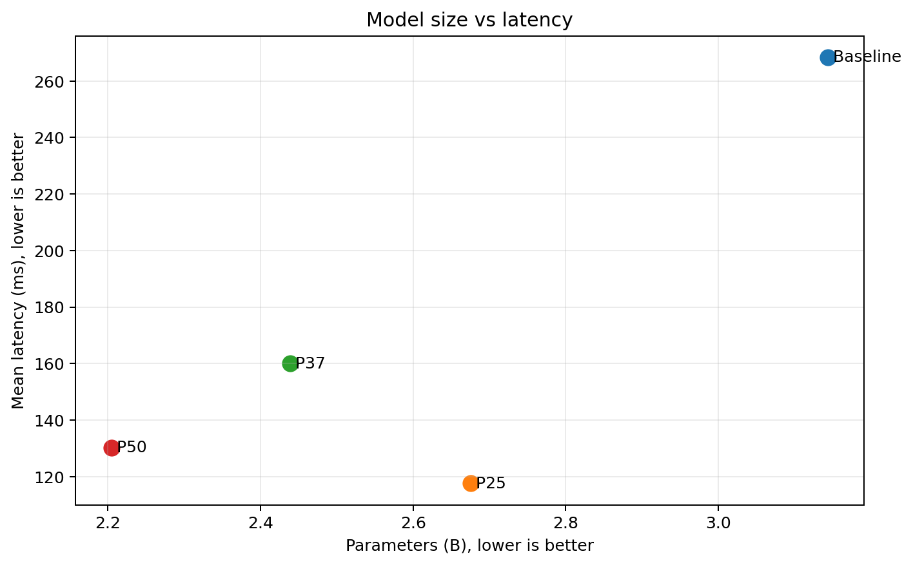
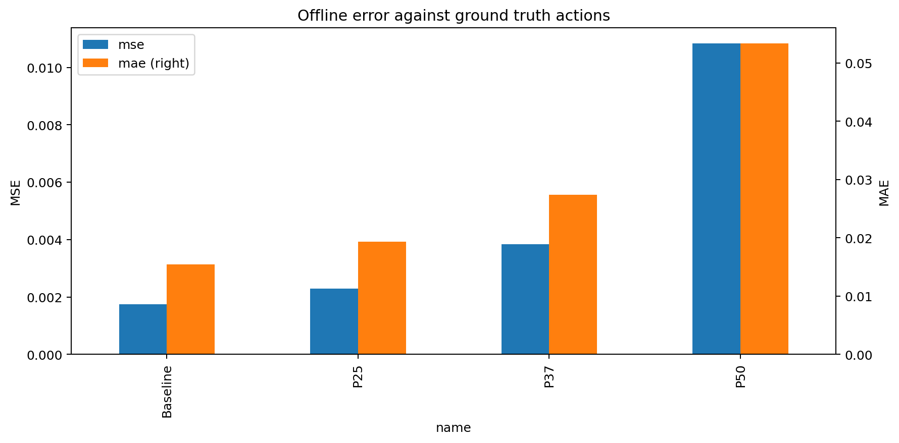
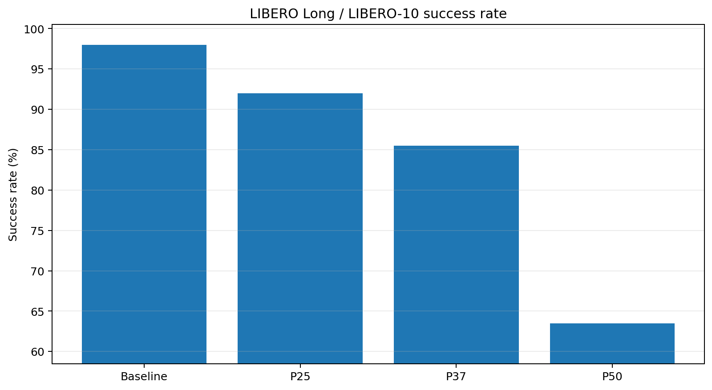
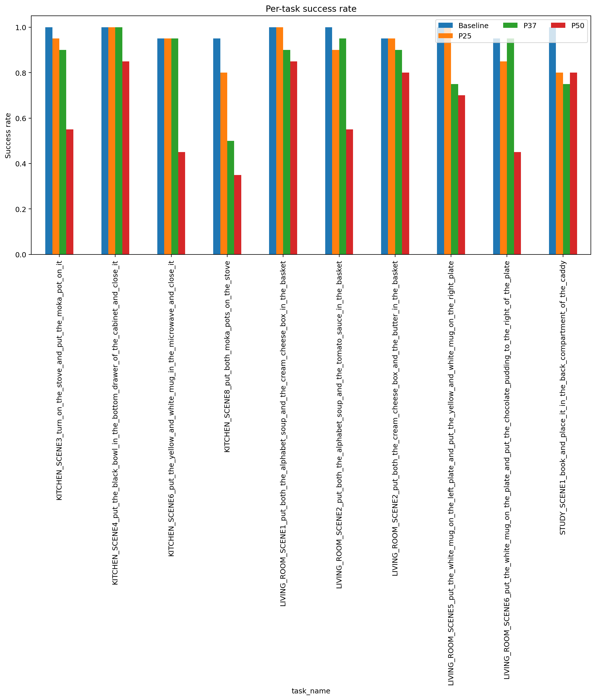
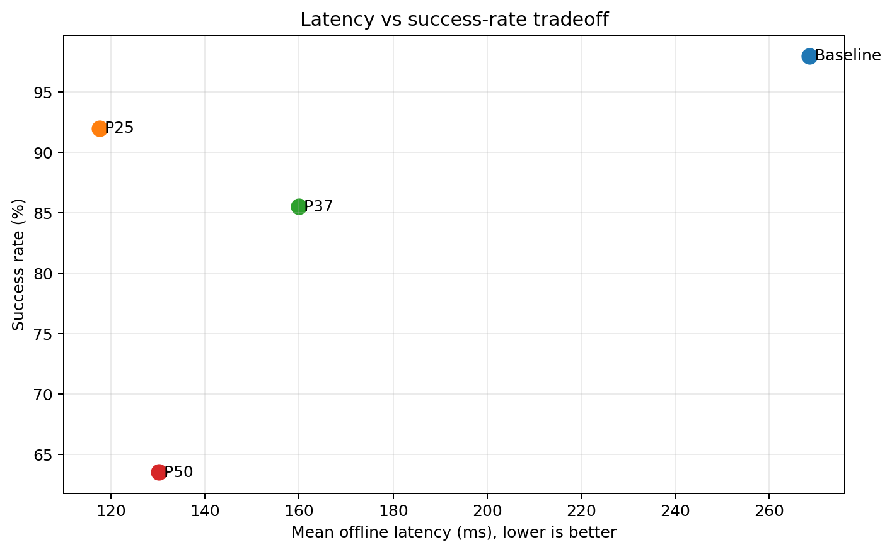

# GR00T-N1.7 — CKA pruning trên LIBERO Long / LIBERO-10

## 1. Mục tiêu

Thí nghiệm đánh giá ảnh hưởng của **CKA-guided layer pruning** lên GR00T-N1.7 trong LIBERO Long (`libero_10`). Các task Long gồm nhiều thao tác nối tiếp, yêu cầu mô hình duy trì mục tiêu và trạng thái trong thời gian dài hơn; vì vậy đây là suite nhạy nhất với việc loại language/Action-DiT layers.

Baseline không pruning được so sánh với `P25`, `P37.5` và `P50` theo parameters, latency, VRAM, MSE/MAE và success rate closed-loop. Mục tiêu là xác định liệu CKA pruning có thể giảm tài nguyên mà vẫn giữ khả năng hoàn thành chuỗi nhiệm vụ dài hay không.

## 2. Ý nghĩa mức pruning và số lớp bị cắt

CKA được tính trên hidden activations của calibration samples để nhận diện các layer có biểu diễn tương đồng. Danh sách lớp giữ lại được chọn theo CKA, không phải chỉ cắt liên tiếp các lớp cuối.

Pruning rate `Pxx` áp dụng cho language backbone và Action-DiT; 4 layer VL self-attention (VLSA) được giữ nguyên. Do đó tỷ lệ giảm parameters toàn model thấp hơn tỷ lệ pruning danh nghĩa.

| Phiên bản | Ý nghĩa | Language | Action-DiT | VLSA | Layer bị cắt | Giảm parameters toàn model |
|---|---|---:|---:|---:|---:|---:|
| Baseline | Không pruning | 16/16 | 32/32 | 4/4 | 0 | 0% |
| P25 | Pruning bảo thủ | 12/16 | 24/32 | 4/4 | 4 language + 8 DiT | 14.91% |
| P37.5 (`P37`) | Pruning trung bình | 10/16 | 20/32 | 4/4 | 6 language + 12 DiT | 22.42% |
| P50 | Pruning mạnh | 8/16 | 16/32 | 4/4 | 8 language + 16 DiT | 29.88% |

Compact result chỉ chứa số lượng layer giữ/cắt, không có `pruning_manifest.json`; exact layer indices cần được truy xuất từ full experiment archive.

## 3. Cấu hình đánh giá

- Suite: `LIBERO Long / LIBERO-10`, 10 task.
- Closed-loop rollout: 20 episode/task, tổng 200 episode/phiên bản.
- Candidate recovery: Action-DiT LoRA rank 16, 3.000 bước, seed 42.
- Chỉ tiêu: parameters, model-load time, offline latency mean/P95, peak VRAM, MSE/MAE, policy RPC latency và success rate.
- Control deadline tham chiếu: 400 ms/action chunk.

## 4. So sánh toàn bộ chỉ số

| Chỉ số | Baseline | P25 | P37.5 | P50 |
|---|---:|---:|---:|---:|
| Parameters | 3.144B | 2.675B | 2.439B | 2.205B |
| Giảm parameters | 0% | 14.91% | 22.42% | 29.88% |
| Trainable parameters ghi nhận | 1.621B | 1.152B | 1.016B | 0.882B |
| Model load (s) | 98.994 | 13.580 | 20.366 | 20.805 |
| Offline latency mean (ms) | 268.458 | 117.540 | 159.964 | 130.239 |
| Offline latency P95 (ms) | 301.493 | 125.270 | 174.234 | 134.054 |
| Latency speedup | 1.000× | 2.284× | 1.678× | 2.061× |
| Peak allocated VRAM (GiB) | 5.952 | 5.065 | 4.623 | 4.182 |
| Peak reserved VRAM (GiB) | 6.041 | 5.180 | 4.721 | 4.281 |
| MSE | 0.001738 | 0.002292 | 0.003838 | 0.010837 |
| MSE / baseline | 1.00× | 1.32× | 2.21× | 6.24× |
| MAE | 0.015405 | 0.019334 | 0.027350 | 0.053356 |
| MAE / baseline | 1.00× | 1.26× | 1.78× | 3.46× |
| Successes / 200 | 196 | 184 | 171 | 127 |
| Success rate | 98.0% | 92.0% | 85.5% | 63.5% |
| SR delta so với baseline | 0 điểm | −6.0 điểm | −12.5 điểm | −34.5 điểm |
| Policy RPC mean (ms) | 537.371 | 483.940 | 475.721 | 410.875 |
| RPC cải thiện | 0% | 9.94% | 11.47% | 23.54% |
| Worst-task RPC P95 (ms) | 609.948 | 540.565 | 514.061 | 446.356 |
| RPC deadline miss rate | 100% | 100% | 99.95% | 70.28% |

### 4.1. Parameters, latency và VRAM

Parameters và VRAM giảm đều theo pruning. Offline latency không hoàn toàn đơn điệu: P25 nhanh hơn P37.5 và P50 dù có nhiều layer hơn. Chênh lệch lớn này có thể chịu ảnh hưởng của hardware/runtime, cache hoặc benchmark context; vì vậy không nên kết luận P25 về bản chất nhanh hơn mọi cấu hình pruning cao hơn chỉ từ một lần đo. Policy RPC có xu hướng hợp lý hơn, giảm từ 537.4 ms ở baseline xuống 483.9, 475.7 và 410.9 ms.

Ngay cả P50 vẫn có mean RPC trên deadline 400 ms và miss khoảng 70.3% action chunks. Do đó lợi ích tốc độ chưa đủ để bù tự động cho mức mất accuracy.

### 4.2. Sai số action

P25 chỉ tăng MSE khoảng 31.9% và MAE 25.5% so với baseline — mức tăng nhỏ hơn nhiều so với Spatial/Goal ở cùng pruning rate. Tuy nhiên, Long vẫn mất 6 điểm success rate, cho thấy offline MSE/MAE thấp không đảm bảo chuỗi hành động dài sẽ thành công. Sai số nhỏ có thể tích lũy qua nhiều bước closed-loop.

P37.5 tăng MSE lên 2.21× baseline, còn P50 tăng 6.24×; xu hướng này đi cùng sự sụt giảm mạnh của success rate.

### 4.3. Success rate tổng hợp

Baseline đạt 196/200 ở lần đo trước. P25 còn 184/200, P37.5 còn 171/200 và P50 chỉ đạt 127/200. Sự giảm liên tục và có biên độ lớn cho thấy Long phụ thuộc mạnh vào capacity đã bị loại bởi language/Action-DiT pruning.

### 4.4. Suy giảm theo task

Ở P25, các task khó nhất gồm:

- đặt cả hai moka pot lên stove: 80%;
- đưa sách vào ngăn sau của caddy: 80%;
- đặt mug và chocolate pudding theo quan hệ bên phải: 85%.

P37.5 làm task hai moka pot giảm còn 50% và hai task khác còn 75%. P50 gây suy giảm trên hầu hết chuỗi dài; thấp nhất là hai moka pot 35%, microwave 45% và mug/chocolate pudding 45%.

Do raw baseline rollout không còn, báo cáo không dùng phân bổ baseline theo task để đưa ra kết luận chi tiết; phân tích task-level tập trung vào các candidate còn dữ liệu.

### 4.5. Trade-off latency–accuracy

P25 là điểm pruned gần baseline nhất nhưng vẫn mất 6 điểm SR. P37.5 và P50 tiết kiệm thêm tài nguyên song accuracy giảm nhanh hơn lợi ích đạt được. Không có candidate nào trong ba mức đã thử đồng thời giữ SR sát baseline và giảm tài nguyên lớn.

## 5. Kết luận trade-off

### Khoảng pruning nên tập trung

Điểm gãy đã xuất hiện trước hoặc tại P25. Vì vậy vùng nên khảo sát tiếp là **12.5%–18.75% pruning danh nghĩa**, thấp hơn tất cả candidate hiện tại. Mục tiêu là tìm mức giảm parameters vừa phải nhưng giữ SR trong khoảng 1–2 điểm so với baseline.

- P12.5 có thể kiểm tra biên an toàn đầu tiên.
- P18.75 giúp xác định liệu có thể tiến gần P25 mà không chịu mức giảm 6 điểm SR.
- Không nên tăng lên trên P25 cho Long trước khi recovery mạnh hơn hoặc kỹ thuật bù sai số được cải thiện.

### Phiên bản có trade-off tốt nhất hiện tại

Nếu **bắt buộc phải chọn một mô hình đã pruning**, **P25 là trade-off tốt nhất trong các bản đã thực nghiệm**:

- giảm 14.91% parameters;
- giảm 14.89% peak allocated VRAM;
- policy RPC mean cải thiện 9.94%;
- MSE/MAE chỉ tăng 1.32×/1.26× baseline;
- success rate 184/200, cao hơn rõ rệt P37.5 và P50.

Nếu yêu cầu chính là giữ accuracy gần baseline, **chưa có mức pruning đã thử nào đạt trade-off chấp nhận được**; baseline vẫn là lựa chọn tốt nhất. P25 chỉ phù hợp khi chấp nhận giảm 6 điểm SR để đổi lấy giảm khoảng 15% tài nguyên.

## 6. Artifact

- [Bảng tổng hợp](tables/variant_summary.csv)
- [Success rate theo task](tables/task_success_rates.csv)
- [So sánh chuẩn hóa](tables/normalized_vs_baseline.csv)
- [Dữ liệu tổng hợp JSON](comparison.json)

Compact references không chứa model weights, video rollout gốc hoặc full source heatmaps. Các bằng chứng đó phải lấy từ full result archives khi lập báo cáo chính thức.
