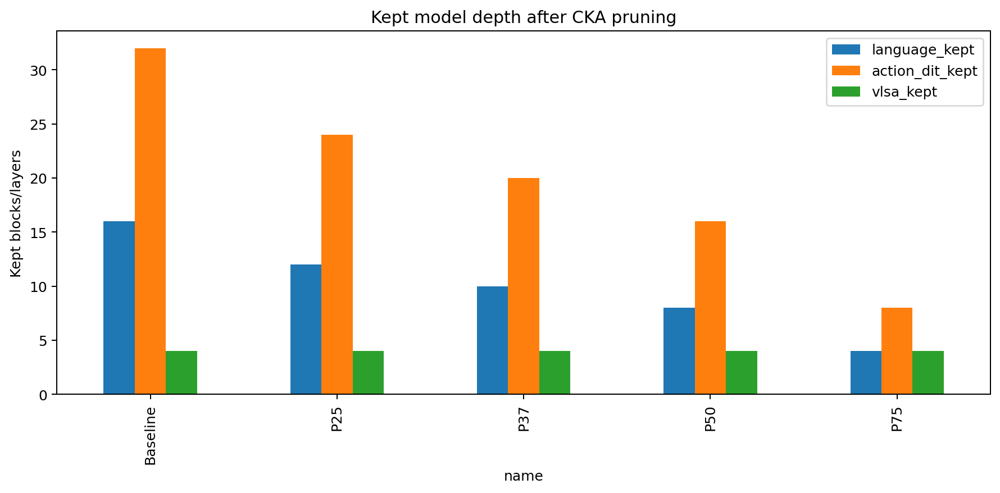
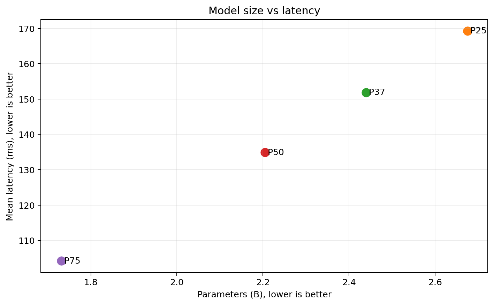
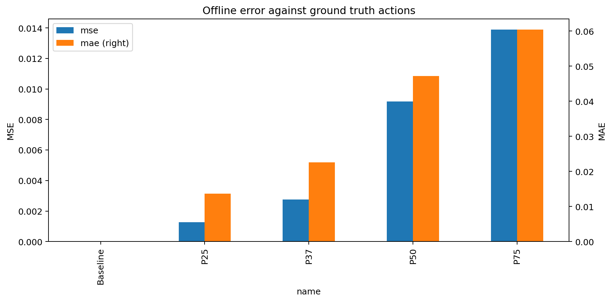
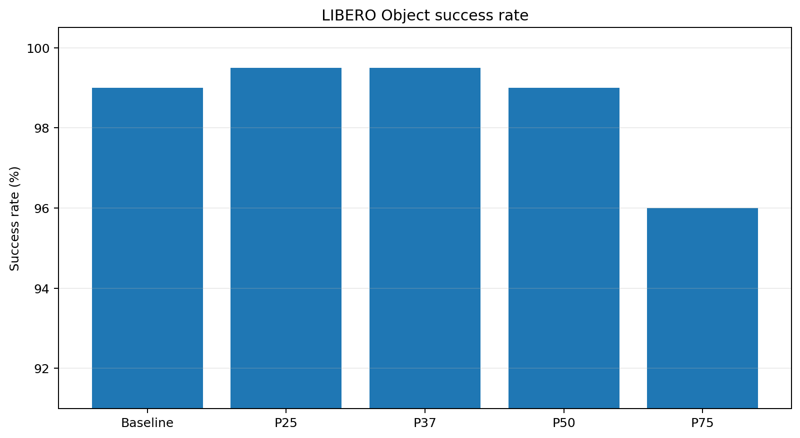
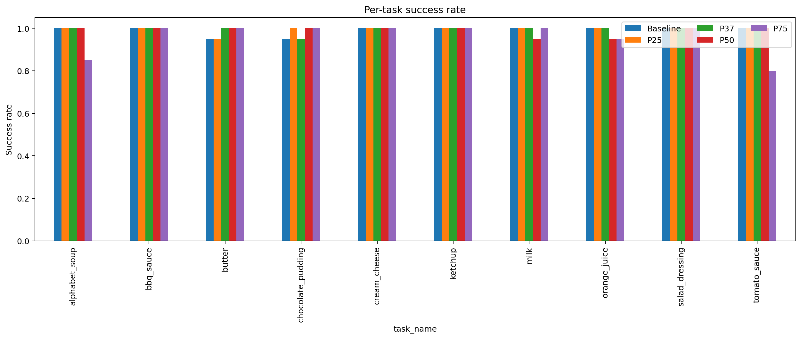
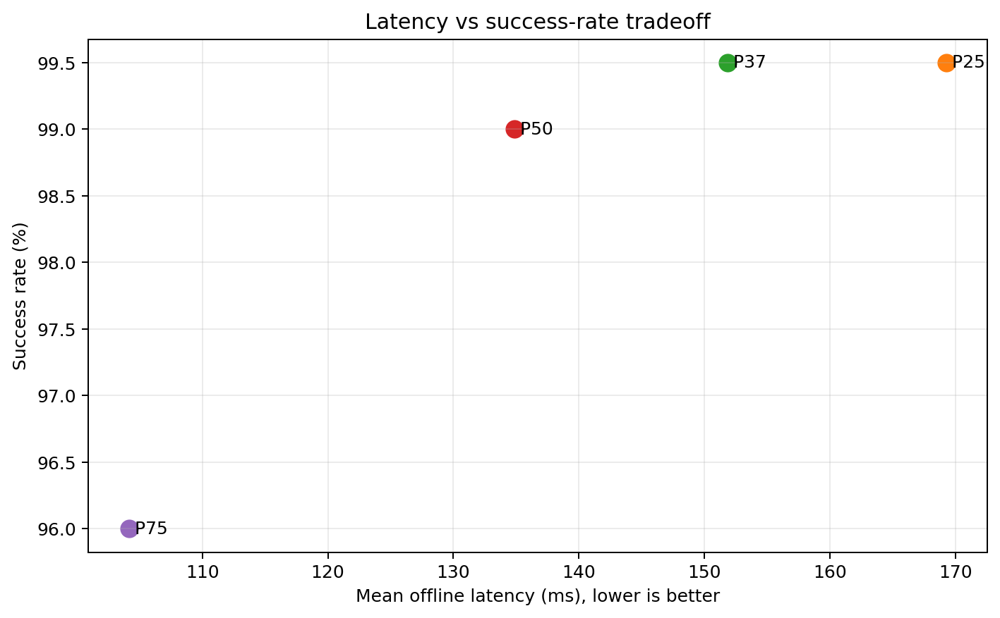

# GR00T-N1.7 — CKA pruning trên LIBERO Object

## 1. Mục tiêu

Thí nghiệm đánh giá mức độ có thể rút gọn GR00T-N1.7 bằng **CKA-guided layer pruning** mà vẫn duy trì khả năng hoàn thành nhiệm vụ. Baseline và bốn ngân sách pruning `P25`, `P37`, `P50`, `P75` được so sánh theo số lớp, số tham số, latency, VRAM, sai số action và success rate closed-loop.

Mục tiêu chính không phải tìm biến thể nhanh nhất bằng mọi giá, mà tìm **điểm trade-off**: giảm tài nguyên đủ lớn nhưng chưa làm suy giảm đáng kể chất lượng điều khiển.

## 2. Ý nghĩa của các mức pruning

CKA đo mức tương đồng biểu diễn giữa hidden states của các lớp. Các lớp có biểu diễn dư thừa cao được xem là ứng viên có thể loại bỏ; danh sách lớp giữ lại được xác định từ CKA calibration thay vì chỉ cắt liên tiếp các lớp cuối.

Trong thí nghiệm này, tỷ lệ `Pxx` áp dụng cho **language backbone và Action-DiT**, còn 4 lớp VL self-attention (VLSA) được giữ nguyên. Vì vision tower, VLSA và các phần khác không bị cắt, tỷ lệ giảm tham số toàn mô hình thấp hơn tỷ lệ pruning danh nghĩa.

| Phiên bản | Ý nghĩa | Language | Action-DiT | VLSA | Lớp bị cắt tổng cộng | Giảm tham số toàn model |
|---|---|---:|---:|---:|---:|---:|
| Baseline | Không pruning | 16/16 | 32/32 | 4/4 | 0 | 0% |
| P25 | Pruning bảo thủ | 12/16 | 24/32 | 4/4 | 4 language + 8 DiT | 14.91% |
| P37.5 (`P37`) | Pruning trung bình | 10/16 | 20/32 | 4/4 | 6 language + 12 DiT | 22.42% |
| P50 | Pruning mạnh | 8/16 | 16/32 | 4/4 | 8 language + 16 DiT | 29.88% |
| P75 | Pruning cực đoan/stress test | 4/16 | 8/32 | 4/4 | 12 language + 24 DiT | 44.94% |

Compact result hiện tại lưu số lượng lớp giữ/cắt nhưng không lưu `pruning_manifest.json`, vì vậy báo cáo không suy đoán index cụ thể của từng lớp bị loại. Muốn truy vết chính xác layer index cần dùng manifest trong archive thí nghiệm gốc.

## 3. Cấu hình đánh giá

- Suite: `LIBERO Object`, 10 task.
- Closed-loop rollout: 20 episode/task, tổng cộng 200 episode/phiên bản.
- Recovery: Action-DiT LoRA rank 16, 3.000 bước, seed 42.
- Chỉ tiêu: parameter count, model-load time, offline latency mean/P95, peak VRAM, MSE/MAE, policy RPC latency và success rate.
- Control deadline tham chiếu: 400 ms cho mỗi action chunk.

Baseline trong bộ Object là baseline LoRA step 3000 được ghép cặp với các ứng viên. Tuy nhiên compact baseline không chứa offline latency/VRAM/MSE/MAE; các ô này được ghi `N/A`, không được nội suy từ suite khác.

## 4. So sánh tổng hợp

| Chỉ số | Baseline | P25 | P37.5 | P50 | P75 |
|---|---:|---:|---:|---:|---:|
| Parameters | 3.144B | 2.675B | 2.439B | 2.205B | 1.731B |
| Giảm parameters so với baseline | 0% | 14.91% | 22.42% | 29.88% | 44.94% |
| Trainable parameters ghi nhận | 1.419B | 1.152B | 1.016B | 0.882B | 0.610B |
| Model load (s) | 57.489 | 51.182 | 29.519 | 29.099 | 40.297 |
| Offline latency mean (ms) | N/A | 169.310 | 151.862 | 134.896 | 104.170 |
| Offline latency P95 (ms) | N/A | 174.284 | 156.471 | 139.873 | 113.748 |
| Peak allocated VRAM (GiB) | N/A | 5.063 | 4.620 | 4.179 | 3.290 |
| Peak reserved VRAM (GiB) | N/A | 5.178 | 4.719 | 4.279 | 3.379 |
| MSE | N/A | 0.001262 | 0.002756 | 0.009182 | 0.013892 |
| MAE | N/A | 0.013641 | 0.022598 | 0.047172 | 0.060439 |
| Successes / 200 | 198 | 199 | 199 | 198 | 192 |
| Success rate | 99.0% | 99.5% | 99.5% | 99.0% | 96.0% |
| Policy RPC weighted mean (ms) | 530.961 | 474.565 | 447.090 | 444.690 | 371.119 |
| Cải thiện RPC so với baseline | 0% | 10.62% | 15.80% | 16.25% | 30.10% |
| Worst-task RPC P95 (ms) | 551.252 | 495.091 | 465.384 | 461.971 | 386.026 |
| RPC deadline miss rate | 100% | 100% | 100% | 99.88% | 0.73% |

### 4.1. Tài nguyên và tốc độ

Mức pruning tăng làm giảm parameters, offline latency và VRAM gần như đơn điệu. So với P25, P50 giảm thêm khoảng 17.6% parameters, giảm offline latency từ 169.31 xuống 134.90 ms và giảm peak allocated VRAM từ 5.06 xuống 4.18 GiB. P75 nhanh và nhỏ nhất, nhưng model-load time không tiếp tục giảm, cho thấy thời gian load còn phụ thuộc I/O và checkpoint layout chứ không chỉ số tham số.

### 4.2. Sai số action

MSE/MAE tăng theo pruning: P37.5 vẫn ở mức tương đối thấp, nhưng P50 có MSE cao khoảng 7.27 lần và MAE cao khoảng 3.46 lần P25. P75 tiếp tục tăng lên 0.013892 MSE và 0.060439 MAE. Điều này cho thấy action prediction đã lệch dần khỏi ground truth ngay cả khi success rate tổng hợp chưa giảm ngay lập tức.

### 4.3. Success rate closed-loop

Baseline, P25, P37.5 và P50 đều nằm trong khoảng 99.0–99.5%. Chênh lệch một episode trên 200 không đủ để kết luận P25/P37.5 chính xác hơn baseline; có thể là biến thiên rollout. Kết quả quan trọng hơn là **P50 giữ cùng 198/200 như baseline** dù giảm gần 30% tổng tham số.

P75 giảm còn 192/200. Sự suy giảm tập trung ở `alphabet_soup` (85%), `tomato_sauce` (80%) và `orange_juice` (95%), trong khi nhiều task khác vẫn đạt 100%. Đây là dấu hiệu pruning cực đoan làm mất độ ổn định ở một số tình huống cụ thể thay vì làm tất cả task suy giảm đồng đều.

### 4.4. Latency–accuracy

P25 → P37.5 → P50 tạo ra đường đánh đổi thuận lợi: latency giảm trong khi success rate gần như giữ nguyên. P75 tạo bước nhảy lớn về tốc độ và là biến thể duy nhất gần như đáp ứng deadline 400 ms, nhưng phải đổi bằng giảm 3 điểm phần trăm success rate và sai số action cao hơn.

## 5. Kết luận trade-off

### Khoảng pruning tốt nhất

Từ các điểm đã đo, vùng trade-off hợp lý cho LIBERO Object nằm trong khoảng **37.5%–50% pruning danh nghĩa**, tương ứng khoảng **22.4%–29.9% giảm tham số toàn mô hình**:

- Dưới vùng này, P25 bảo toàn tốt nhưng mức tiết kiệm còn tương đối nhỏ.
- Trong vùng này, success rate vẫn ở 99.0–99.5% trong khi parameters, VRAM và latency giảm rõ rệt.
- Trên vùng này, P75 cho thấy điểm gãy: success rate giảm xuống 96% và lỗi action tăng thêm.

### Bản có trade-off tốt nhất hiện tại

**P50 là trade-off tổng thể tốt nhất trong các phiên bản đã thực nghiệm trên Object** nếu ưu tiên đồng thời kích thước, tốc độ và success rate:

- giảm 29.88% tổng parameters;
- offline latency mean 134.90 ms;
- peak allocated VRAM 4.18 GiB;
- policy RPC mean tốt hơn baseline 16.25%;
- giữ đúng success rate baseline: 198/200, tương đương 99.0%.

P37.5 là lựa chọn **bảo thủ tốt nhất** nếu ưu tiên độ gần ground truth: MSE/MAE thấp hơn P50 đáng kể, success rate 199/200 và vẫn giảm 22.42% parameters. P75 chỉ phù hợp khi deadline điều khiển dưới 400 ms là yêu cầu cứng và có thể chấp nhận suy giảm accuracy.

Kết luận này chỉ áp dụng cho dữ liệu Object hiện có. Để xác định chính xác điểm tối ưu bên trong khoảng 37.5%–50%, bước tiếp theo nên kiểm thử thêm một mức trung gian (ví dụ P43.75), giữ nguyên calibration set, recovery recipe, seed, phần cứng và 200 rollout episodes.

## 6. Artifact

- [Bảng tổng hợp](tables/variant_summary.csv)
- [Success rate theo task](tables/task_success_rates.csv)
- [So sánh chuẩn hóa](tables/normalized_vs_baseline.csv)
- [Dữ liệu tổng hợp JSON](comparison.json)

Các compact references không chứa model weights, video rollout gốc hoặc đầy đủ source heatmaps; các bằng chứng đó cần lấy từ full result archives khi lập báo cáo chính thức.
