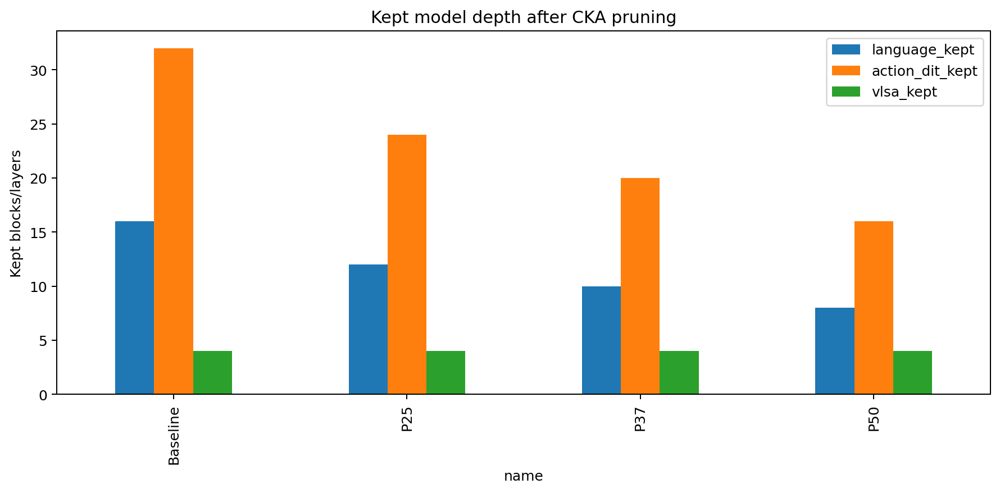
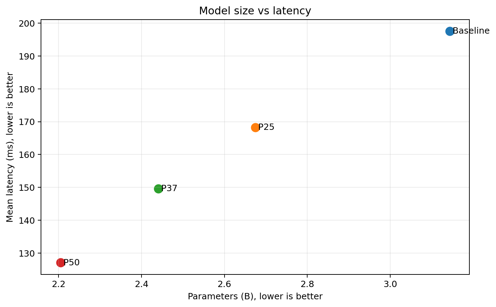
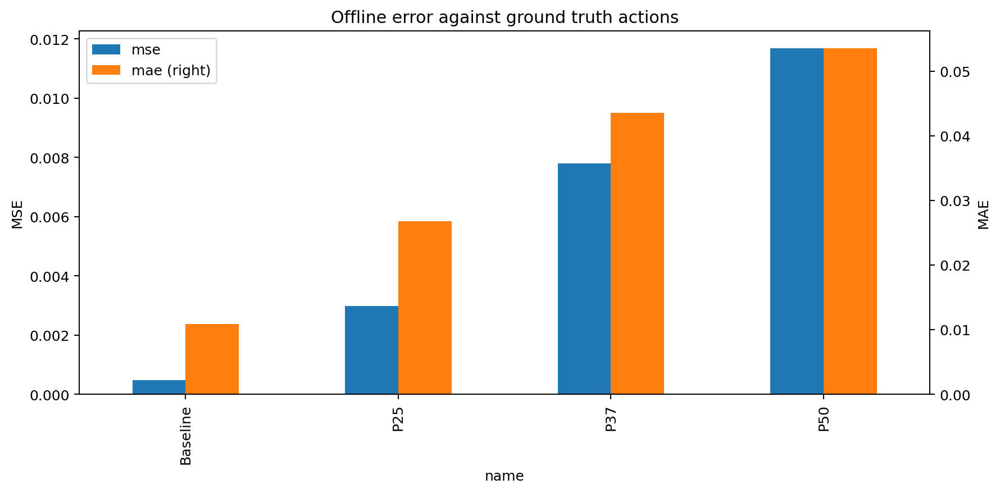
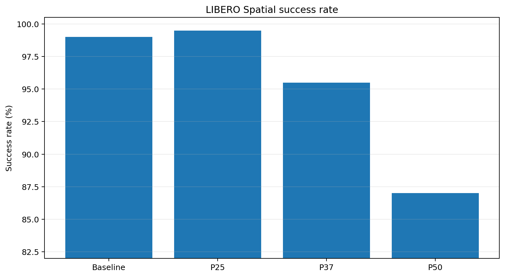
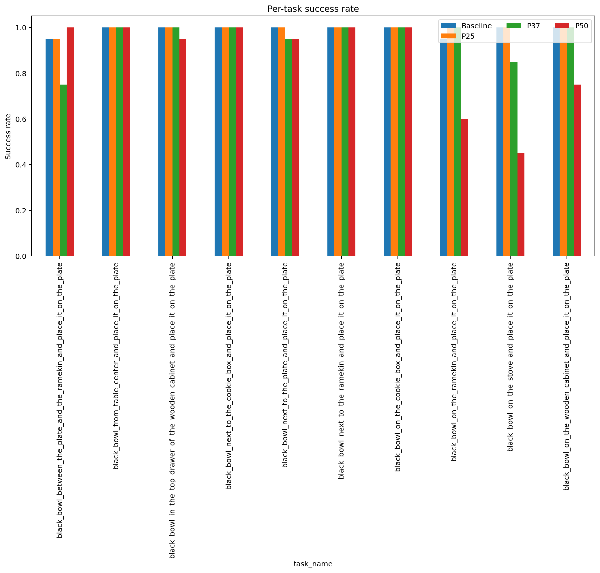
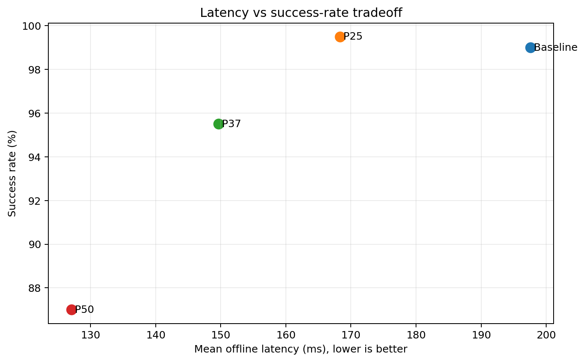

# GR00T-N1.7 — CKA pruning trên LIBERO Spatial

## 1. Mục tiêu

Thí nghiệm đánh giá ảnh hưởng của **CKA-guided layer pruning** lên GR00T-N1.7 trong LIBERO Spatial. Suite này yêu cầu mô hình hiểu chính xác quan hệ không gian giữa đồ vật và vị trí đích, nên có thể nhạy hơn Object khi language/Action-DiT bị rút gọn.

Baseline không pruning được so sánh với `P25`, `P37.5` và `P50` theo số tham số, latency, VRAM, sai số action và success rate closed-loop. Mục tiêu là tìm mức pruning giảm tài nguyên rõ rệt nhưng chưa phá vỡ khả năng suy luận không gian.

## 2. Các mức pruning và lớp bị cắt

CKA được tính từ hidden activations trên calibration set để nhận diện các lớp có biểu diễn tương đồng/dư thừa. Việc giữ hoặc loại lớp dựa trên CKA, không phải đơn giản cắt liên tiếp các lớp cuối.

Tỷ lệ `Pxx` áp dụng cho language backbone và Action-DiT. Bốn lớp VL self-attention (VLSA) được giữ nguyên, vì vậy mức giảm tham số toàn mô hình thấp hơn pruning rate danh nghĩa.

| Phiên bản | Ý nghĩa | Language | Action-DiT | VLSA | Lớp bị cắt | Giảm parameters toàn model |
|---|---|---:|---:|---:|---:|---:|
| Baseline | Không pruning | 16/16 | 32/32 | 4/4 | 0 | 0% |
| P25 | Pruning bảo thủ | 12/16 | 24/32 | 4/4 | 4 language + 8 DiT | 14.91% |
| P37.5 (`P37`) | Pruning trung bình | 10/16 | 20/32 | 4/4 | 6 language + 12 DiT | 22.37% |
| P50 | Pruning mạnh | 8/16 | 16/32 | 4/4 | 8 language + 16 DiT | 29.88% |

Compact results chỉ chứa số lượng lớp giữ/cắt, không chứa `pruning_manifest.json`; do đó báo cáo không suy đoán index chính xác của từng layer bị loại. Danh sách index cần được truy xuất từ full experiment archive.

## 3. Cấu hình đánh giá

- Suite: `LIBERO Spatial`, 10 task.
- Closed-loop rollout: 20 episode/task, tổng 200 episode/phiên bản.
- Candidate recovery: Action-DiT LoRA rank 16, 3.000 bước, seed 42.
- Chỉ tiêu: parameters, model-load time, offline latency mean/P95, peak VRAM, MSE/MAE, policy RPC latency và success rate.
- Control deadline tham chiếu: 400 ms/action chunk.

## 4. So sánh toàn bộ chỉ số

| Chỉ số | Baseline | P25 | P37.5 | P50 |
|---|---:|---:|---:|---:|
| Parameters | 3.144B | 2.675B | 2.441B | 2.205B |
| Giảm parameters | 0% | 14.91% | 22.37% | 29.88% |
| Trainable parameters ghi nhận | 1.621B | 1.152B | 1.018B | 0.882B |
| Model load (s) | 69.197 | 54.469 | 20.987 | 15.277 |
| Offline latency mean (ms) | 197.594 | 168.298 | 149.644 | 127.056 |
| Offline latency P95 (ms) | 201.130 | 172.838 | 154.276 | 133.102 |
| Latency speedup | 1.000× | 1.174× | 1.320× | 1.555× |
| Peak allocated VRAM (GiB) | 5.952 | 5.065 | 4.627 | 4.179 |
| Peak reserved VRAM (GiB) | 6.041 | 5.180 | 4.721 | 4.301 |
| MSE | 0.000479 | 0.002990 | 0.007807 | 0.011685 |
| MSE / baseline | 1.00× | 6.24× | 16.30× | 24.39× |
| MAE | 0.010883 | 0.026730 | 0.043522 | 0.053530 |
| MAE / baseline | 1.00× | 2.46× | 4.00× | 4.92× |
| Successes / 200 | 198 | 199 | 191 | 174 |
| Success rate | 99.0% | 99.5% | 95.5% | 87.0% |
| SR delta so với baseline | 0 điểm | +0.5 điểm | −3.5 điểm | −12.0 điểm |
| Policy RPC mean (ms) | 523.724 | 512.547 | 440.801 | 422.894 |
| RPC cải thiện | 0% | 2.13% | 15.83% | 19.25% |
| Worst-task RPC P95 (ms) | 561.005 | 547.068 | 471.095 | 451.894 |
| RPC deadline miss rate | 100% | 100% | 100% | 99.51% |

### 4.1. Parameters, latency và VRAM

Pruning giảm tài nguyên gần như đơn điệu. P25 giảm khoảng 14.9% parameters/VRAM và tăng tốc offline 1.174×. P37.5 đạt 1.320×, còn P50 đạt 1.555× và giảm gần 30% parameters. Tuy nhiên, policy RPC vẫn lớn hơn deadline 400 ms ở tất cả biến thể; P50 chỉ giảm mean RPC xuống 422.9 ms và vẫn miss deadline khoảng 99.5% số action chunk.

### 4.2. MSE/MAE action

Sai số tăng ngay từ P25 và tăng nhanh khi pruning mạnh hơn. P25 có MSE gấp 6.24 lần baseline nhưng success rate chưa giảm; điều này cho thấy sai khác action nhỏ chưa lập tức chuyển thành thất bại closed-loop. Từ P37.5, MSE đạt 16.30× baseline và bắt đầu đi kèm giảm success rate. P50 có MSE 24.39× và MAE 4.92× baseline.

### 4.3. Success rate tổng hợp

P25 đạt 199/200, cao hơn baseline đúng một episode. Chênh lệch này không đủ để kết luận P25 chính xác hơn; kết luận phù hợp là P25 **giữ được chất lượng baseline trong sai số rollout**.

P37.5 giảm còn 191/200 (−3.5 điểm phần trăm), còn P50 giảm mạnh xuống 174/200 (−12 điểm). Đây là bằng chứng Spatial nhạy với pruning hơn Object và điểm gãy xuất hiện trước P50.

### 4.4. Suy giảm theo task

P37.5 không suy giảm đồng đều: task đặt bát nằm giữa plate và ramekin chỉ đạt 75%, task trên stove đạt 85%, trong khi phần lớn task khác vẫn 95–100%.

Ở P50, ba task giảm mạnh nhất là:

- `black_bowl_on_the_stove...`: 45%;
- `black_bowl_on_the_ramekin...`: 60%;
- `black_bowl_on_the_wooden_cabinet...`: 75%.

Điều này cho thấy pruning mạnh làm yếu khả năng phân biệt các quan hệ không gian/điểm đặt cụ thể, thay vì gây lỗi ngẫu nhiên như nhau trên mọi nhiệm vụ.

### 4.5. Trade-off latency–success rate

P25 là điểm gần góc trên-trái hợp lý nhất: latency giảm nhưng success rate giữ nguyên. P37.5 và P50 tiếp tục nhanh hơn, song mức mất accuracy lớn dần và không đạt được deadline RPC 400 ms.

## 5. Kết luận trade-off

### Khoảng pruning nên tập trung

Với tiêu chí success rate không giảm quá khoảng 1 điểm phần trăm, mức đã được chứng minh an toàn hiện tại là **P25**. Điểm tối ưu tiềm năng nhiều khả năng nằm trong khoảng **25%–37.5% pruning danh nghĩa**, tương ứng khoảng **14.9%–22.4% giảm tổng parameters**, nhưng gần phía 25% hơn vì P37.5 đã mất 3.5 điểm SR.

Để xác định biên chính xác, nên thử thêm P31.25 với cùng calibration set, recovery, seed, phần cứng và 200 rollout episodes. Nếu P31.25 giữ SR gần baseline, có thể thu hẹp khoảng tốt nhất thành 25%–31.25%.

### Phiên bản có trade-off tốt nhất hiện tại

**P25 là trade-off tốt nhất trong các phiên bản Spatial đã thực nghiệm**:

- giảm 14.91% parameters;
- giảm 14.89% peak allocated VRAM;
- offline latency giảm 14.83%, speedup 1.174×;
- success rate 199/200, về thực tế tương đương baseline 198/200.

P37.5 chỉ phù hợp khi chấp nhận giảm khoảng 3.5 điểm SR để đổi lấy 22.37% parameter reduction và 1.320× speedup. P50 không phải trade-off phù hợp nếu accuracy là yêu cầu chính, vì giảm 12 điểm SR dù tài nguyên được tối ưu mạnh hơn.

## 6. Artifact

- [Bảng tổng hợp](tables/variant_summary.csv)
- [Success rate theo task](tables/task_success_rates.csv)
- [So sánh chuẩn hóa](tables/normalized_vs_baseline.csv)
- [Dữ liệu tổng hợp JSON](comparison.json)

Compact references không chứa model weights, video rollout gốc hoặc full source heatmaps. Các bằng chứng đó phải lấy từ full result archives khi lập báo cáo chính thức.
